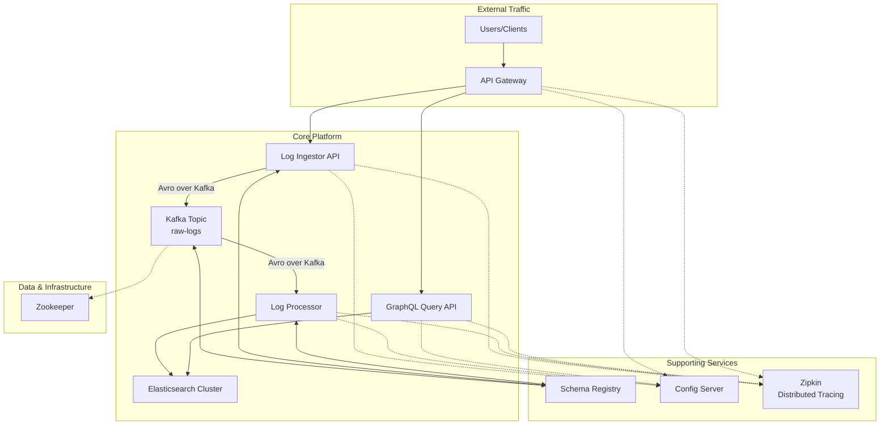

# High-Throughput Log Analytics Platform (Production-Ready)

A distributed, event-driven log analytics platform built with Java 17, Spring Boot 3, and Elasticsearch. This enhanced version incorporates production-ready patterns including an API Gateway, centralized configuration, a schema registry, distributed tracing, and containerization for the entire stack.

## Architecture Overview

This platform is designed for high-throughput, resilient log ingestion and provides fast, full-text search capabilities. The system uses an event-driven architecture with Kafka and Confluent Schema Registry, ensuring data integrity, scalability, and decoupling between components. All services are centrally configured and observable via distributed tracing.

### High-Level Design (HLD)



## Core Components & Responsibilities

### 1. API Gateway (`api-gateway`)
**Port: 8088**
- **Purpose**: Single, unified entry point for all incoming traffic.
- **Technology**: Spring Cloud Gateway.
- **Responsibilities**:
  - Route requests to appropriate downstream services (`log-ingestor`, `query-api`).
  - Provide a coarse-grained security layer (rate limiting, authentication can be added here).
  - Centralize cross-cutting concerns like metrics and tracing for all ingress traffic.

### 2. Config Server (`config-server`)
**Port: 8888**
- **Purpose**: Centralized configuration management for all microservices.
- **Technology**: Spring Cloud Config.
- **Responsibilities**:
  - Serve environment-specific configurations from a centralized source (e.g., a Git repository).
  - Eliminate configuration drift and simplify management across services.

### 3. Log Ingestor (`log-ingestor`)
- **Purpose**: High-availability API for log ingestion.
- **Responsibilities**:
  - Accept HTTP POST requests with log events.
  - Validate and serialize log data into **Avro format** using a schema from the **Schema Registry**.
  - Publish events to a Kafka topic, propagating **OpenTelemetry trace context**.

### 4. Apache Kafka & Confluent Schema Registry
- **Kafka Port**: 9092
- **Schema Registry Port**: 8081
- **Purpose**: Durable, scalable message buffer with enforced data contracts.
- **Responsibilities**:
  - **Kafka**: Decouples ingestion from processing, providing durability and back-pressure resistance.
  - **Schema Registry**: Enforces a strict Avro schema for all messages in the `raw-logs` topic, preventing data quality issues.

### 5. Log Processor (`log-processor`)
- **Purpose**: Consumes, enriches, and indexes log events.
- **Responsibilities**:
  - Consume messages from Kafka, deserializing them using the Avro schema from the **Schema Registry**.
  - Transform and enrich log events.
  - Perform efficient bulk indexing into Elasticsearch.
  - Propagates distributed tracing context from Kafka messages.

### 6. Elasticsearch Cluster
**Port: 9200**
- **Purpose**: Distributed search and analytics engine.
- **Capabilities**: Full-text search, aggregations, and horizontal scalability.

### 7. Query API (`query-api`)
- **Purpose**: Secure GraphQL API for searching and analyzing logs.
- **Responsibilities**:
  - Provide flexible GraphQL endpoints for complex queries.
  - **Security**: Implements query depth and complexity analysis to prevent DoS attacks.
  - Execute Elasticsearch queries and return structured results.

### 8. Distributed Tracing (OpenTelemetry & Zipkin)
**Zipkin Port: 9411**
- **Purpose**: Provides end-to-end visibility of requests as they travel through the system.
- **Technology**: OpenTelemetry SDKs with a Zipkin exporter.
- **Features**:
  - Trace context is propagated across HTTP calls (via API Gateway) and Kafka messages.
  - Allows developers to visualize request latency, identify bottlenecks, and debug issues in a distributed environment.

## Technology Stack

- **Runtime**: Java 17
- **Framework**: Spring Boot 3.2.x & Spring Cloud 2023.0.0
- **API Gateway**: Spring Cloud Gateway
- **Configuration**: Spring Cloud Config
- **Messaging**: Apache Kafka with **Confluent Schema Registry (Avro)**
- **Search Engine**: Elasticsearch 8.x
- **Distributed Tracing**: **OpenTelemetry** with **Zipkin**
- **GraphQL Security**: Query complexity/depth analysis
- **Build Tool**: Maven
- **Containerization**: **Docker** and **Docker Compose** (for all services)

## Local Development

The entire platform, including all applications and backing services, can be started with a single command.

### Prerequisites
- Docker and Docker Compose

### Starting The Entire Platform

1.  **Build all application images and start all containers:**
    ```bash
    docker-compose up --build -d
    ```
    This command will:
    - Build the Docker image for each microservice (`api-gateway`, `config-server`, `log-ingestor`, `log-processor`, `query-api`).
    - Start all Java applications.
    - Start all backing services: Zookeeper, Kafka, Schema Registry, Elasticsearch, Kibana, and Zipkin.

2.  **Verify services are running:**
    - **API Gateway**: `http://localhost:8088/actuator/health`
    - **Kibana**: `http://localhost:5601`
    - **Zipkin Traces**: `http://localhost:9411`
    - **GraphQL API**: `http://localhost:8088/graphiql` (accessed via Gateway)

### Testing the Platform

All requests should now go through the API Gateway on port `8088`.

1.  **Ingest sample logs:**
    ```bash
    curl -X POST http://localhost:8088/api/v1/logs \
      -H "Content-Type: application/json" \
      -d '[
        {
          "serviceName": "user-service",
          "logLevel": "INFO",
          "message": "User login successful via gateway",
          "metadata": {"userId": "12345", "ip": "192.168.1.1"}
        }
      ]'
    ```

2.  **Search logs using GraphQL (via Gateway):**
    - Open the interactive GraphiQL UI: **http://localhost:8088/graphiql**
    - Run a query:
      ```graphql
      query searchLogs {
        searchLogs(input: { fullTextQuery: "gateway" }) {
          results {
            id
            timestamp
            serviceName
            logLevel
            message
          }
        }
      }
      ```

3.  **View Distributed Traces:**
    - Perform a few ingest and query operations.
    - Open the Zipkin UI: **http://localhost:9411**
    - Click "Run Query" to see traces. You should see the full flow from `api-gateway` -> `log-ingestor` -> `kafka` -> `log-processor`.

4.  **Stopping the platform:**
    ```bash
    docker-compose down
    ```

## Production Deployment and Security

This enhanced architecture is significantly more robust and secure.

### Configuration Management
- **Spring Cloud Config** provides a single source of truth for all configurations, suitable for managing different environments (dev, staging, prod).

### Security
- **API Gateway**: Acts as a control point for implementing authentication (e.g., OAuth2/OIDC), rate limiting, and WAF rules.
- **GraphQL Security**: The Query API is protected against overly complex or deep queries that could be used to overload the system.
- **Schema Registry**: Enforces strict message schemas, preventing malformed data from entering the processing pipeline and improving data security and quality.

### Observability
- **Centralized Logging**: The platform's core purpose.
- **Metrics**: All services expose Prometheus metrics via Actuator.
- **Distributed Tracing**: **OpenTelemetry** provides critical end-to-end visibility, which is essential for debugging and performance tuning in a production microservices environment.

## Future Enhancements

- **Stream Processing**: Add Apache Kafka Streams for real-time log analysis
- **Machine Learning**: Implement anomaly detection and log pattern recognition
- **Data Archival**: Implement time-based data retention and archival to cold storage
- **Multi-tenancy**: Support for tenant isolation and resource quotas
- **Advanced Analytics**: Real-time dashboards and alerting based on log patterns