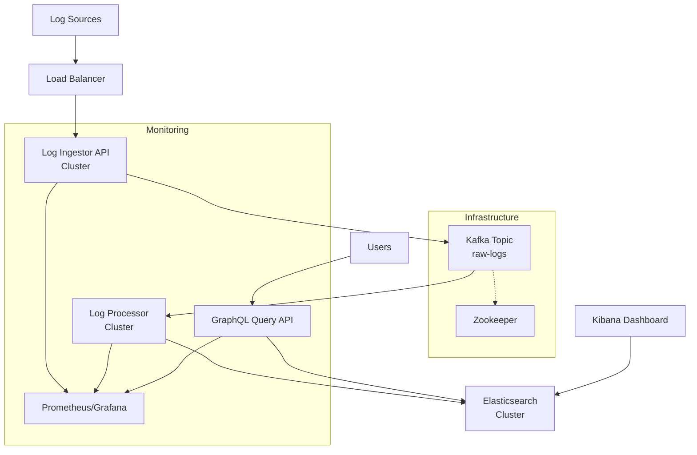

# High-Throughput Log Analytics Platform

A distributed, event-driven log analytics platform built with Java 17, Spring Boot 3, and Elasticsearch for real-time log ingestion, processing, and searching.

## Architecture Overview

This platform is designed to handle high-throughput log ingestion and provide fast, full-text search capabilities across distributed applications. The system follows an event-driven architecture using Kafka as the central messaging backbone, ensuring scalability, resilience, and decoupling between components.

### High-Level Design (HLD)



## Core Components & Responsibilities

### 1. Log Ingestor (`log-ingestor`)
**Port: 8080**

- **Purpose**: High-availability, stateless REST API entry point for log ingestion
- **Responsibilities**:
  - Accept HTTP POST requests with batches of log events
  - Validate incoming log data
  - Publish events to Kafka topics for downstream processing
  - Provide metrics and health checks
- **Key Features**:
  - Asynchronous Kafka publishing with proper error handling
  - Batching support for high-throughput scenarios
  - Configurable retry mechanisms and dead letter queues
  - Comprehensive metrics collection (ingested logs, failures, latency)

### 2. Apache Kafka
**Port: 9092**

- **Purpose**: Durable, scalable message buffer that decouples ingestion from processing
- **Benefits**:
  - **Durability**: Messages are persisted to disk and replicated
  - **Scalability**: Horizontal scaling through partitioning
  - **Decoupling**: Producers and consumers operate independently
  - **Fault Tolerance**: Built-in replication and failover mechanisms
- **Configuration**:
  - Topic: `raw-logs` with configurable partitions and replication factor
  - Consumer groups enable parallel processing across multiple processor instances

### 3. Log Processor (`log-processor`)
**Port: 8081**

- **Purpose**: Consumes log events from Kafka, enriches them, and performs bulk indexing into Elasticsearch
- **Responsibilities**:
  - Consume messages from Kafka topics with proper offset management
  - Transform and enrich log events with additional metadata (timestamps, IDs, computed fields)
  - Perform efficient bulk indexing to Elasticsearch
  - Handle processing errors and implement retry logic
- **Key Features**:
  - Batch processing for optimal Elasticsearch indexing performance
  - Configurable consumer groups for parallel processing
  - Automatic schema mapping and index management
  - Comprehensive error handling with dead letter queue support

### 4. Elasticsearch Cluster
**Port: 9200**

- **Purpose**: Distributed search and analytics engine for indexed log data
- **Capabilities**:
  - **Full-text Search**: Advanced text analysis and relevance scoring
  - **Aggregations**: Real-time analytics and statistical computations
  - **Scalability**: Horizontal scaling with automatic sharding and replication
  - **Performance**: Sub-second search response times across millions of documents
- **Index Configuration**:
  - Dynamic mapping for flexible log event schemas
  - Optimized field types for efficient storage and searching
  - Time-based index rotation for better performance and management

### 5. Query API (`query-api`)
**Port: 8082**

- **Purpose**: GraphQL API interface for searching and analyzing indexed logs
- **Responsibilities**:
  - Provide flexible GraphQL endpoints with multiple filter options
  - Execute complex Elasticsearch queries and aggregations
  - Return structured search results with pagination
  - Offer statistical and analytical queries
- **GraphQL Capabilities**:
  - Schema-driven API with type safety and introspection
  - Full-text search across log messages with flexible filtering
  - Multi-field filtering (service name, log level, time range)
  - Advanced sorting and pagination
  - Aggregation queries for analytics and statistics
  - Interactive GraphiQL interface for development and testing

## Scalability & Resilience Strategy

### Horizontal Scaling
- **Log Ingestor**: Deploy multiple instances behind a load balancer for high availability
- **Log Processor**: Scale consumer instances based on Kafka partition count and processing load
- **Query API**: Deploy multiple read-only instances for distributed query processing
- **Elasticsearch**: Add nodes to the cluster for increased storage and query capacity

### Kafka Partitioning Strategy
- **Partition Key**: Uses service name as partition key for balanced distribution
- **Consumer Groups**: Multiple processor instances consume from different partitions in parallel
- **Scalability**: Add more partitions and consumers to handle increased throughput

### Fault Tolerance
- **Kafka Replication**: Configure topic replication factor ≥ 3 for production
- **Elasticsearch Replicas**: Set replica count based on availability requirements
- **Circuit Breakers**: Implement circuit breakers in API gateways for resilience
- **Health Checks**: All services expose health endpoints for monitoring and auto-healing

### Performance Optimizations
- **Batch Processing**: Both Kafka consumption and Elasticsearch indexing use batching
- **Async Processing**: Non-blocking I/O throughout the pipeline
- **Connection Pooling**: Efficient resource utilization for database connections
- **Caching**: Strategic caching at API and search layers

## Technology Stack

- **Runtime**: Java 17 with GraalVM support for potential native compilation
- **Framework**: Spring Boot 3.2.x with Spring Cloud for microservices patterns
- **Messaging**: Apache Kafka for event streaming
- **Search Engine**: Elasticsearch 8.x for indexing and searching
- **Build Tool**: Maven with multi-module project structure
- **Containerization**: Docker and Docker Compose for local development
- **Monitoring**: Micrometer with Prometheus/Grafana integration
- **Testing**: TestContainers for integration testing

## Local Development

### Prerequisites
- Java 17+
- Maven 3.8+
- Docker and Docker Compose

### Starting Infrastructure

1. **Start the infrastructure services:**
```bash
docker-compose up -d
```

This will start:
- Zookeeper (port 2181)
- Kafka (port 9092)
- Elasticsearch (port 9200)
- Kibana (port 5601) for log visualization

2. **Verify services are running:**
```bash
# Check Kafka
docker exec -it kafka kafka-topics --bootstrap-server localhost:9092 --list

# Check Elasticsearch
curl -X GET "localhost:9200/_cluster/health?pretty"

# Check Kibana
open http://localhost:5601
```

### Running the Applications

1. **Build all modules:**
```bash
mvn clean install
```

2. **Start each service (in separate terminals):**

```bash
# Log Ingestor (Port 8080)
cd log-ingestor
mvn spring-boot:run

# Log Processor (Port 8081)
cd log-processor
mvn spring-boot:run

# Query API (Port 8082)
cd query-api
mvn spring-boot:run
```

### Testing the Platform

1. **Ingest sample logs:**
```bash
curl -X POST http://localhost:8080/api/v1/logs \
  -H "Content-Type: application/json" \
  -d '[
    {
      "serviceName": "user-service",
      "logLevel": "INFO",
      "message": "User login successful",
      "metadata": {"userId": "12345", "ip": "192.168.1.1"}
    },
    {
      "serviceName": "order-service",
      "logLevel": "ERROR",
      "message": "Payment processing failed",
      "metadata": {"orderId": "order-789", "error": "timeout"}
    }
  ]'
```

2. **Search logs using GraphQL:**

The Query API now uses GraphQL for flexible and powerful querying. You can use the interactive GraphiQL interface or send GraphQL queries directly.

**Using GraphiQL Interface:**
- Open http://localhost:8082/graphiql in your browser
- Use the interactive query editor with auto-completion and documentation

**Example GraphQL Queries:**

```graphql
# Search for error logs from a specific service
query searchForErrors {
  searchLogs(input: {
    logLevel: "ERROR",
    serviceName: "order-service",
    fullTextQuery: "payment"
  }) {
    results {
      id
      timestamp
      serviceName
      logLevel
      message
      metadata
    }
    totalHits
    currentPage
    hasNext
  }
}

# Get log statistics
query getLogStats {
  logStats(input: {
    fromTime: "2025-01-01T00:00:00Z",
    toTime: "2025-01-02T00:00:00Z"
  }) {
    totalLogs
    errorCount
    warningCount
    timeRange {
      fromTime
      toTime
    }
  }
}

# Fetch a specific log by ID
query getLogById {
  logById(id: "user-service-1735689600000-abc12345") {
    id
    timestamp
    serviceName
    logLevel
    message
    isError
    isWarning
  }
}
```

**Using cURL:**
```bash
# GraphQL search query
curl -X POST http://localhost:8082/graphql \
  -H "Content-Type: application/json" \
  -d '{
    "query": "query { searchLogs(input: { fullTextQuery: \"payment\", page: 0, size: 10 }) { results { id timestamp serviceName logLevel message } totalHits } }"
  }'

# Get statistics
curl -X POST http://localhost:8082/graphql \
  -H "Content-Type: application/json" \
  -d '{
    "query": "query { logStats { totalLogs errorCount warningCount } }"
  }'
```

3. **View in Kibana:**
   - Open http://localhost:5601
   - Create an index pattern for `logs*`
   - Explore the data in Discover tab

4. **Interactive GraphQL Development:**
   - Open http://localhost:8082/graphiql 
   - Use the interactive GraphiQL interface for query development
   - Explore the schema documentation and auto-completion features
   - Test complex queries with real-time results

### Monitoring and Metrics

All services expose metrics via Spring Boot Actuator:
- Health: `http://localhost:808X/actuator/health`
- Metrics: `http://localhost:808X/actuator/metrics`
- Prometheus: `http://localhost:808X/actuator/prometheus`

**GraphQL API Additional Endpoints:**
- GraphQL Endpoint: `http://localhost:8082/graphql`
- GraphiQL Interactive UI: `http://localhost:8082/graphiql` 
- GraphQL Schema: Available through introspection in GraphiQL

## Production Deployment

### Kubernetes Deployment
- Use Helm charts for templated deployments
- Configure HorizontalPodAutoscaler for auto-scaling
- Set up proper resource limits and requests
- Implement readiness and liveness probes

### Configuration Management
- Use ConfigMaps and Secrets for environment-specific configurations
- Implement configuration hot-reloading where applicable
- Set up proper log levels and structured logging

### Monitoring and Alerting
- Deploy Prometheus for metrics collection
- Set up Grafana dashboards for visualization
- Configure alerts for critical metrics (error rates, latency, throughput)
- Implement distributed tracing with Jaeger or Zipkin

### Security Considerations
- Enable Elasticsearch security features (authentication, TLS)
- Implement API authentication and rate limiting
- Use network policies to restrict inter-service communication
- Regular security scanning of container images

## Future Enhancements

- **Stream Processing**: Add Apache Kafka Streams for real-time log analysis
- **Machine Learning**: Implement anomaly detection and log pattern recognition
- **Data Archival**: Implement time-based data retention and archival to cold storage
- **Multi-tenancy**: Support for tenant isolation and resource quotas
- **Advanced Analytics**: Real-time dashboards and alerting based on log patterns