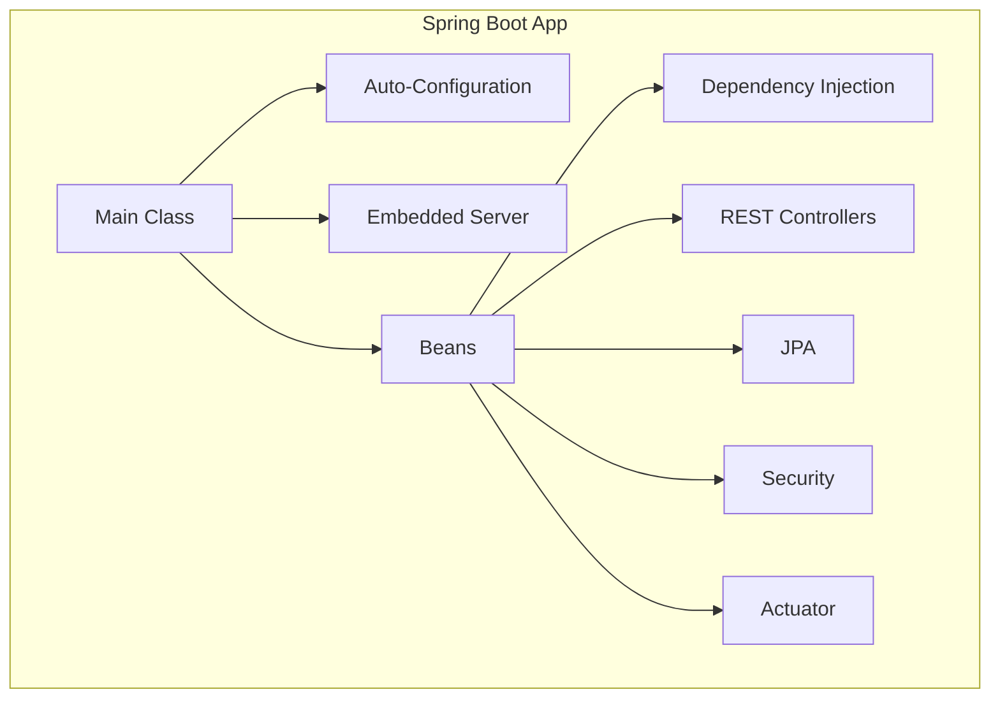

# Spring Boot: MAANG Interview Prep Guide

## 1. Architecture & Core Concepts

### High-Level Architecture
- **Auto-Configuration:** Automatically configures beans based on classpath and properties.
- **Embedded Server:** Runs apps with Tomcat/Jetty/Undertow, no external server needed.
- **Starter Dependencies:** Pre-configured dependencies for common use cases (web, JPA, security, etc.).
- **Beans & DI:** Components managed by Spring's IoC container; dependency injection via `@Autowired`.
- **Actuator:** Exposes endpoints for monitoring and management.
- **Profiles:** Environment-specific configuration (dev, prod, test).

**Diagram:**

### Core Concepts
- **REST Controllers:** `@RestController` for HTTP APIs.
- **JPA:** ORM for database access.
- **Transactions:** `@Transactional` for ACID operations.
- **Security:** Spring Security for authentication/authorization.
- **Configuration:** `application.properties`/`yml`, `@Value`, `@ConfigurationProperties`.
- **Testing:** `@SpringBootTest`, MockMvc, TestRestTemplate.

### Lifecycle
- **Startup:** Main class runs, context loads, beans initialized.
- **Context Refresh:** Beans reloaded on config changes.
- **Shutdown:** Graceful shutdown via Actuator or JVM hooks.

## 2. Interview Questions & Answers
- **Q:** How does Spring Boot auto-configuration work?
  - *A:* It scans the classpath and application properties, then configures beans automatically using `@Conditional` annotations. Developers can override defaults via properties or custom beans.
- **Q:** What is the difference between `@Component`, `@Service`, and `@Repository`?
  - *A:* All are stereotypes for beans. `@Component` is generic, `@Service` is for business logic, `@Repository` is for data access and enables exception translation.
- **Q:** How does Spring Boot handle database transactions?
  - *A:* Uses `@Transactional` to manage transactions. By default, rolls back on runtime exceptions. Integrates with JPA/Hibernate for ACID compliance.
- **Q:** How do you secure a Spring Boot REST API?
  - *A:* Use Spring Security with JWT, OAuth2, or basic auth. Configure security filters and roles via `WebSecurityConfigurerAdapter` or new SecurityFilterChain.
- **Q:** How does Actuator help in production?
  - *A:* Exposes endpoints for health, metrics, info, env, and more. Integrates with Prometheus/Micrometer for monitoring and alerting.

## 3. Important Commands
- **Run app:** `./mvnw spring-boot:run` or `./gradlew bootRun`
- **Build jar:** `./mvnw clean package` or `./gradlew build`
- **Run tests:** `./mvnw test` or `./gradlew test`
- **Actuator endpoints:** `/actuator/health`, `/actuator/metrics`, `/actuator/env`, etc.

## 4. Key Metrics for Fault Tolerance
- **Health Checks:** `/actuator/health` endpoint for liveness/readiness.
- **Circuit Breakers:** Monitor fallback and open/close state (Resilience4j, Hystrix).
- **Thread Pools:** Monitor executor pools for bottlenecks.
- **DB Connection Pool:** Monitor HikariCP/DBCP for leaks, exhaustion.

**Why Needed:**
- Detect slow DB, thread starvation, or failing dependencies early.

**Tools:**
- **Spring Boot Actuator:** Built-in endpoints.
- **Micrometer:** Metrics collection.
- **Prometheus + Grafana:** Dashboards and alerting. 