# Advanced System Design Topics for MAANG SDE L5/L6 Interviews

This guide covers advanced system design topics crucial for SDE interviews at MAANG companies (L5/L6 level). Each topic includes a detailed explanation, use cases, anti-patterns, alternatives, and common interview questions.

---

## 1. Log-Structured Merge Trees (LSM Trees)
**Explanation:** LSM Trees optimize write-heavy workloads by batching writes in memory (memtables) and periodically merging them to disk (SSTables). This design reduces random disk writes and is used in modern NoSQL databases (e.g., Cassandra, LevelDB, RocksDB). Compaction merges and sorts data, improving write throughput but potentially impacting read latency.

**Diagram:**
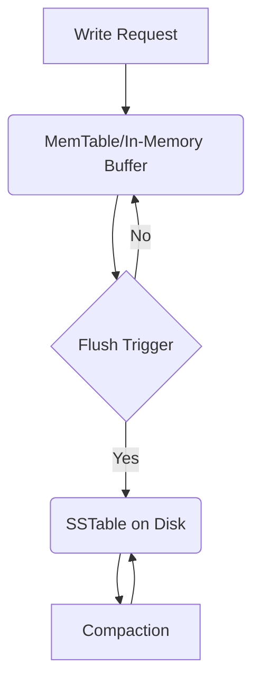
**Real-World Example:** Cassandra uses LSM trees to handle massive write loads for time-series data.
**When to Use:** High write throughput, append-only workloads, time-series data, write-optimized storage.
**When Not to Use:** Read-heavy workloads, low-latency random reads, small datasets.
**Alternatives:** B+ Trees, in-memory databases, columnar stores.
**Anti-Patterns:** Using LSM trees for workloads with frequent random reads or updates can degrade performance due to compaction overhead.
**Common Interview Questions:**
- How does compaction work in LSM trees?
  - *Answer:* Compaction in LSM trees is the process of merging smaller, sorted files (SSTables) into larger ones, removing deleted or duplicate entries and maintaining sorted order. This reduces storage usage and improves read performance by minimizing the number of files to search. Compaction can be triggered periodically or based on thresholds.
- What are the trade-offs between LSM and B+ trees?
  - *Answer:* LSM trees are optimized for write-heavy workloads, as they batch writes in memory and write sequentially to disk, reducing random I/O. However, they can suffer from higher read amplification and compaction overhead. B+ trees, on the other hand, provide better read performance and are suitable for read-heavy workloads but can be less efficient for high write rates due to random disk writes.
- How do LSM trees handle deletions and updates?
  - *Answer:* Deletions and updates in LSM trees are handled by writing tombstone markers or new values to the memtable. The actual removal of deleted data occurs during compaction, when tombstones are processed and obsolete entries are purged from disk.
- What is write amplification in LSM trees, and how can it be mitigated?
  - *Answer:* Write amplification refers to the phenomenon where a single logical write results in multiple physical writes due to compaction. It can be mitigated by tuning compaction strategies, using larger SSTables, or employing tiered compaction to reduce the frequency of merges.
- How do LSM trees impact read latency, and what techniques can optimize reads?
  - *Answer:* LSM trees can increase read latency because data may be spread across multiple SSTables. Techniques like Bloom filters, block caches, and hierarchical indexes help optimize reads by quickly filtering out irrelevant files and reducing disk I/O.

## 2. Bloom Filters
**Explanation:** Probabilistic data structure for fast membership checks with space efficiency. False positives possible, but no false negatives. Used to avoid unnecessary disk lookups.

**Diagram:**
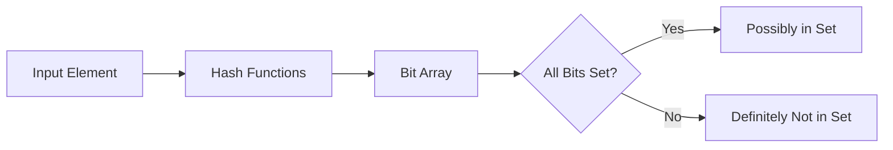
**Real-World Example:** Used in HBase and Cassandra to check if a key might exist before disk access.
**When to Use:** Caching, distributed systems, database indexing, network security.
**When Not to Use:** When false positives are unacceptable, exact membership required.
**Alternatives:** Hash sets, Cuckoo filters.
**Anti-Patterns:** Using Bloom filters for security-critical checks where false positives are unacceptable.
**Common Interview Questions:**
- How do you tune the false positive rate in a Bloom filter?
  - *Answer:* The false positive rate is tuned by adjusting the size of the bit array and the number of hash functions. More bits and more hash functions reduce the false positive rate but increase memory usage and computation.
- What happens when a Bloom filter becomes full?
  - *Answer:* As more elements are added, the probability of false positives increases. A "full" Bloom filter will return true for almost all queries, making it ineffective. At this point, a new filter should be created or a scalable variant used.
- How do you delete elements from a Bloom filter?
  - *Answer:* Standard Bloom filters do not support deletion. Counting Bloom filters, which use counters instead of bits, allow decrementing counters to support deletions.
- What are the trade-offs of using a Bloom filter?
  - *Answer:* Bloom filters are space-efficient and fast but allow false positives and do not support deletions (unless using a counting variant). They are not suitable when exact membership is required.

## 3. Cache Eviction Policies (LRU, LFU, FIFO)
**Explanation:** Strategies to remove items from cache when full. LRU removes least recently used, LFU least frequently used, FIFO oldest. Choice impacts cache hit ratio and system performance.

**Diagram:**
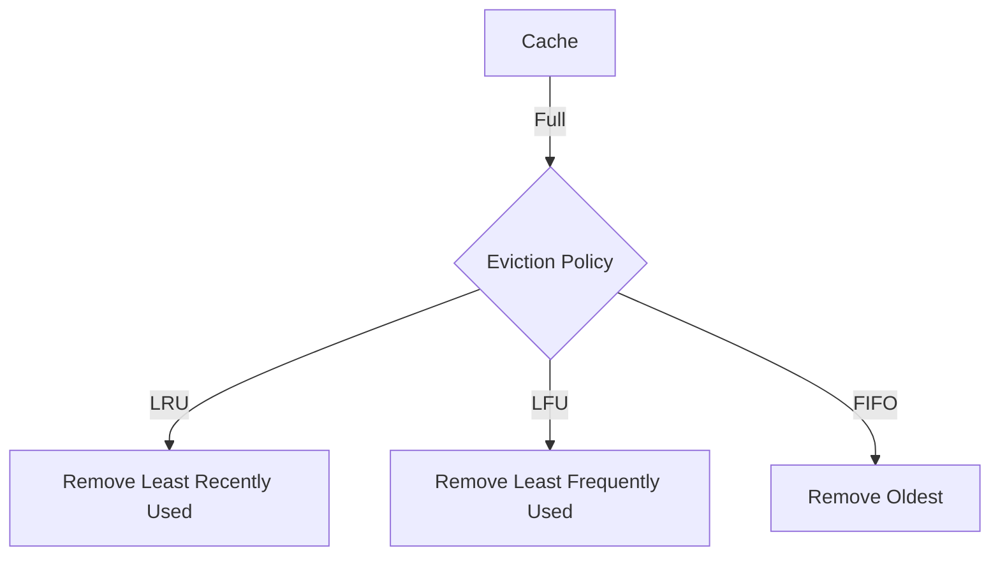
**Real-World Example:** Redis supports LRU and LFU eviction policies for memory management.
**When to Use:** Memory-constrained environments, web servers, databases, CDN edge nodes.
**When Not to Use:** When all items are equally important, or cache churn is high.
**Alternatives:** Random eviction, ARC, custom policies.
**Anti-Patterns:** Using LRU in workloads with cyclic access patterns can lead to cache thrashing.
**Common Interview Questions:**
- How would you implement an LRU cache?
  - *Answer:* An LRU cache can be implemented using a combination of a hash map for O(1) access and a doubly linked list to track the order of usage. When an item is accessed, it is moved to the front of the list. When the cache is full, the least recently used item (at the end of the list) is evicted.
- When is LFU better than LRU?
  - *Answer:* LFU is better when frequently accessed items should be retained regardless of recency, such as in workloads with a small set of hot items accessed repeatedly over time. LRU is better for workloads with temporal locality.
- What are the trade-offs of FIFO vs. LRU?
  - *Answer:* FIFO is simpler but may evict frequently used items if they were added early. LRU is more complex but better retains recently used items, improving hit rates for workloads with temporal locality.
- How do you prevent cache thrashing?
  - *Answer:* Use a larger cache size, tune eviction policies, or use adaptive policies like ARC to reduce the impact of cyclic access patterns.

## 4. Concurrency Control (Optimistic, Pessimistic)
**Explanation:** Techniques to manage simultaneous access to shared resources. Optimistic assumes minimal conflict, Pessimistic locks resources. Used in databases and distributed systems to ensure consistency.

**Diagram:**
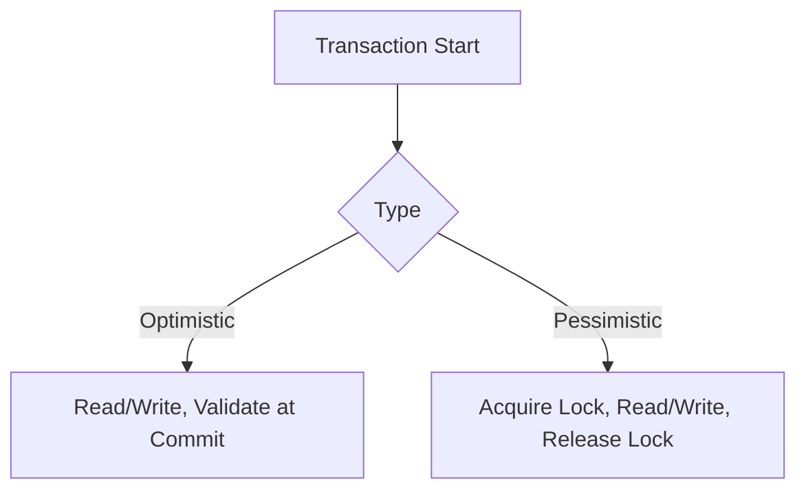
```
**Real-World Example:** Databases like PostgreSQL use MVCC (optimistic), while MySQL InnoDB supports row-level locking (pessimistic).
**When to Use:** Multi-user systems, databases, distributed transactions.
**When Not to Use:** Single-user systems, low contention environments.
**Alternatives:** MVCC, timestamp ordering, two-phase locking.
**Anti-Patterns:** Overusing pessimistic locks can lead to deadlocks and reduced throughput.
**Common Interview Questions:**
- How do you prevent deadlocks?
  - *Answer:* Deadlocks can be prevented by acquiring locks in a consistent order, using lock timeouts, or employing deadlock detection algorithms that identify and resolve cycles in the wait-for graph.
- What is the difference between optimistic and pessimistic concurrency control?
  - *Answer:* Optimistic concurrency control assumes conflicts are rare and checks for conflicts only at commit time, rolling back if necessary. Pessimistic control locks resources before access, preventing conflicts but potentially reducing concurrency.
- When would you use one over the other?
  - *Answer:* Use optimistic control in low-contention environments where conflicts are rare and high concurrency is desired. Use pessimistic control when conflicts are frequent or data integrity is critical.
- How does MVCC relate to optimistic concurrency?
  - *Answer:* MVCC is a form of optimistic concurrency control that allows multiple versions of data, enabling non-blocking reads and reducing contention between readers and writers.

## 5. Change Data Capture (CDC)
**Explanation:** Captures and propagates changes in data sources to downstream systems in real time. Used for event-driven architectures and data replication. CDC can be log-based, trigger-based, or query-based.

**Diagram:**
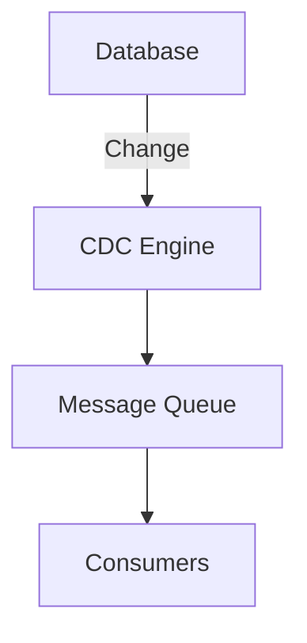
```
**Real-World Example:** Debezium streams changes from MySQL/PostgreSQL to Kafka for real-time analytics.
**When to Use:** Real-time analytics, microservices, data lakes, ETL pipelines.
**When Not to Use:** Simple batch jobs, when latency is not critical.
**Alternatives:** Polling, event sourcing, triggers.
**Anti-Patterns:** Using CDC for high-frequency changes without proper backpressure can overwhelm consumers.
**Common Interview Questions:**
- How does log-based CDC work?
  - *Answer:* Log-based CDC reads the database's transaction log to capture changes (inserts, updates, deletes) as they happen, ensuring minimal impact on the source database and providing a reliable, ordered stream of changes.
- What are the challenges in ensuring exactly-once delivery with CDC?
  - *Answer:* Challenges include handling failures, deduplication, and ensuring idempotency. Systems must track offsets or transaction IDs and use transactional messaging or idempotent consumers to avoid duplicates.
- How do you handle schema changes in CDC?
  - *Answer:* Schema changes can be handled by versioning events, updating downstream consumers, and using schema registries to manage and propagate changes safely.
- What are the trade-offs between trigger-based and log-based CDC?
  - *Answer:* Trigger-based CDC is easier to implement but can add overhead to the source database and miss some changes. Log-based CDC is more efficient and reliable but requires access to internal database logs and more complex setup.

## 6. Distributed Locking
**Explanation:** Ensures mutual exclusion across distributed systems. Common implementations use Redis (Redlock), Zookeeper, or etcd. Critical for leader election and resource coordination.

**Diagram:**
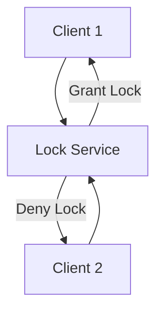
```
**Real-World Example:** Redis Redlock algorithm for distributed locks in microservices.
**When to Use:** Leader election, resource coordination, job scheduling.
**When Not to Use:** Single-node systems, stateless operations.
**Alternatives:** Local locks, database row locks, optimistic concurrency.
**Anti-Patterns:** Relying on distributed locks for high-frequency, low-latency operations can introduce bottlenecks.
**Common Interview Questions:**
- How does the Redlock algorithm work?
  - *Answer:* Redlock acquires locks on a majority of independent Redis nodes, using timeouts and unique tokens to ensure only one client holds the lock. If a client fails to acquire the lock on a majority, it releases any partial locks.
- What are the failure modes in distributed locking?
  - *Answer:* Failure modes include network partitions, node failures, and clock drift. These can lead to split-brain scenarios or lock loss, so systems must handle retries and lock expiration.
- How do you prevent split-brain scenarios?
  - *Answer:* Use quorum-based locking, short lock timeouts, and ensure that only a majority of nodes can grant a lock. Monitor for network partitions and design for safe lock recovery.
- When should you avoid distributed locks?
  - *Answer:* Avoid distributed locks for high-frequency, low-latency operations or when stateless, idempotent designs are possible, as locks can become a bottleneck or single point of failure.

## 7. Write-Ahead Logging (WAL)
**Explanation:** Ensures durability by logging changes before applying them. Used in databases and file systems for crash recovery and ACID compliance.

**Diagram:**
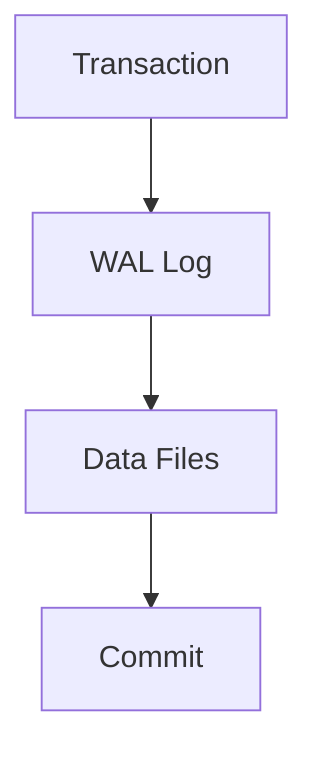
```
**Real-World Example:** PostgreSQL uses WAL for transaction durability and crash recovery.
**When to Use:** Transactional systems, crash recovery, ACID compliance.
**When Not to Use:** Non-critical data, stateless services.
**Alternatives:** Journaling, shadow paging.
**Anti-Patterns:** Not flushing WAL to disk before acknowledging success can lead to data loss.
**Common Interview Questions:**
- How does WAL ensure durability?
  - *Answer:* WAL ensures durability by writing changes to a persistent log before applying them to the main data files. If a crash occurs, the log can be replayed to recover committed transactions.
- What is the difference between WAL and journaling?
  - *Answer:* WAL logs changes before they are applied, while journaling typically logs the intent to change. WAL is more granular and is used for databases, while journaling is common in file systems.
- How do you optimize WAL performance?
  - *Answer:* Use sequential disk writes, group commits, and fast storage (e.g., SSDs). Tune flush intervals and batch writes to balance durability and throughput.
- What are the risks of not syncing WAL to disk?
  - *Answer:* If WAL is not flushed to disk before acknowledging a transaction, a crash can result in data loss or inconsistency.

## 8. Consensus Algorithms (Raft, Paxos)
**Explanation:** Achieve agreement among distributed nodes. Raft is easier to implement; Paxos is more theoretical. Used for leader election, configuration management, and distributed databases.

**Diagram:**
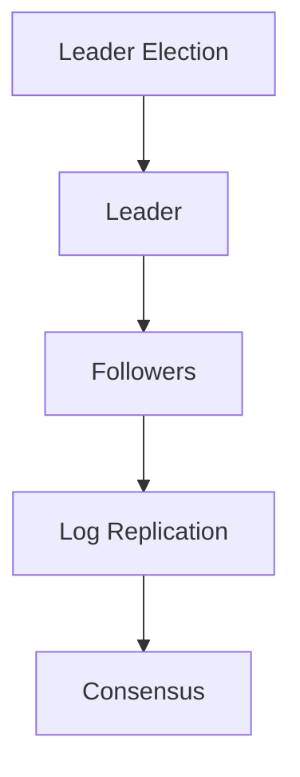
```
**Real-World Example:** etcd and Consul use Raft for distributed consensus.
**When to Use:** Distributed databases, leader election, configuration management.
**When Not to Use:** Single-node systems, non-critical coordination.
**Alternatives:** Gossip protocols, eventual consistency.
**Anti-Patterns:** Using consensus for non-critical or high-frequency operations can reduce system throughput.
**Common Interview Questions:**
- How does Raft achieve consensus?
  - *Answer:* Raft elects a leader, which receives all client requests and replicates log entries to followers. Once a majority acknowledge an entry, it is committed. Followers apply entries in order, ensuring consistency.
- What are the failure scenarios in Paxos?
  - *Answer:* Paxos can handle node failures and message loss, but progress may stall if a majority of nodes are unavailable. Split-brain and network partitions can delay consensus.
- When would you use Raft over Paxos?
  - *Answer:* Raft is preferred for practical systems due to its understandability and easier implementation. Paxos is more general but harder to implement correctly.
- What is log replication in Raft?
  - *Answer:* The leader appends entries to its log and sends them to followers. Once a majority have written the entry, it is committed and applied to the state machine.

## 9. Sharding and Partitioning
**Explanation:** Splits data across multiple servers for scalability. Sharding uses keys; partitioning can be range, hash, or list-based. Enables horizontal scaling but introduces complexity in cross-shard queries.

**Diagram:**
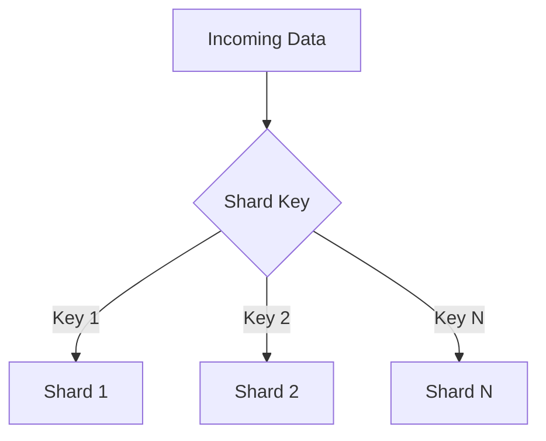
```
**Real-World Example:** MongoDB uses sharding for large-scale data distribution.
**When to Use:** Large datasets, high throughput, geographic distribution.
**When Not to Use:** Small datasets, complex cross-shard queries.
**Alternatives:** Vertical scaling, replication.
**Anti-Patterns:** Poor shard key selection can lead to hotspots and uneven data distribution.
**Common Interview Questions:**
- How do you choose a shard key?
  - *Answer:* Choose a key that distributes data and load evenly across all shards, avoiding hot spots. Good candidates are user IDs, hashes, or composite keys.
- What are the challenges with cross-shard transactions?
  - *Answer:* Cross-shard transactions require coordination between multiple shards, increasing complexity, latency, and the risk of partial failures or inconsistencies.
- How do you rebalance shards?
  - *Answer:* Rebalancing involves moving data from overloaded shards to underutilized ones, updating routing metadata, and ensuring minimal downtime or impact on availability.
- What are the trade-offs of range vs. hash partitioning?
  - *Answer:* Range partitioning allows efficient range queries but can lead to hot spots. Hash partitioning distributes load evenly but makes range queries less efficient.

## 10. Multi-Version Concurrency Control (MVCC)
**Explanation:** Maintains multiple versions of data for concurrent access. Used in PostgreSQL, Oracle, etc. Enables non-blocking reads and high concurrency.

**Diagram:**
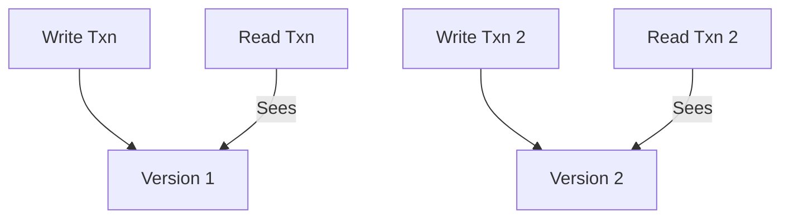
```
**Real-World Example:** PostgreSQL uses MVCC to allow readers and writers to operate without blocking each other.
**When to Use:** High concurrency, long-running transactions, read-heavy workloads.
**When Not to Use:** Simple systems, low concurrency.
**Alternatives:** Two-phase locking, timestamp ordering.
**Anti-Patterns:** Not cleaning up old versions (vacuuming) can lead to storage bloat.
**Common Interview Questions:**
- How does MVCC prevent read-write conflicts?
  - *Answer:* MVCC provides each transaction with a snapshot of the database at a point in time. Writers create new versions, so readers never block writers and vice versa, preventing conflicts.
- What is snapshot isolation?
  - *Answer:* Snapshot isolation means each transaction sees a consistent snapshot of the data as of its start time, preventing dirty reads and non-repeatable reads.
- How are old versions cleaned up?
  - *Answer:* Old versions are removed by a background process (e.g., vacuuming in PostgreSQL) once no active transactions need them.
- What are the trade-offs of MVCC?
  - *Answer:* MVCC improves concurrency and read performance but increases storage usage and requires periodic cleanup of old versions.

## 11. Distributed Caching
**Explanation:** Caches data across multiple nodes to reduce latency and load. Examples: Redis Cluster, Memcached. Improves scalability and fault tolerance.

**Diagram:**
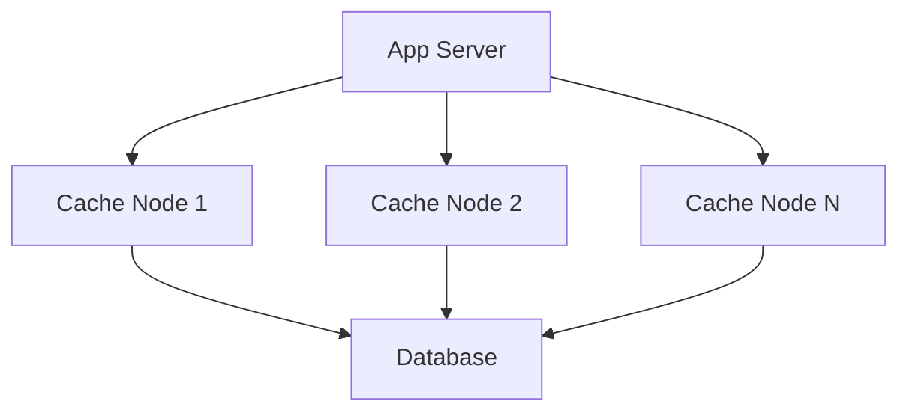
```
**Real-World Example:** Twitter uses distributed caching to serve timelines at scale.
**When to Use:** High-traffic web apps, microservices, session storage.
**When Not to Use:** Small-scale apps, when consistency is critical.
**Alternatives:** Local cache, CDN, database cache.
**Anti-Patterns:** Not handling cache invalidation can lead to stale data.
**Common Interview Questions:**
- How do you ensure cache consistency across nodes?
  - *Answer:* Use cache invalidation protocols (e.g., write-through, write-behind, or pub/sub for invalidation), consistent hashing, and versioning to keep data synchronized. For strong consistency, use distributed locks or consensus.
- What are the trade-offs of distributed vs. local caching?
  - *Answer:* Distributed caching improves scalability and fault tolerance but adds network latency and complexity. Local caching is faster but can lead to stale data and is less scalable.
- How do you handle cache failures?
  - *Answer:* Use fallback to the database, implement cache replication, and monitor cache health. Design for graceful degradation and avoid single points of failure.
- What is cache stampede and how do you prevent it?
  - *Answer:* Cache stampede occurs when many clients request the same missing key simultaneously. Prevent it with request coalescing, locking, or pre-warming hot keys.

## 12. Rate Limiting
**Explanation:** Controls request rates to protect services. Token bucket, leaky bucket, and fixed window are common algorithms. Prevents abuse and ensures fair resource usage.

**Diagram:**
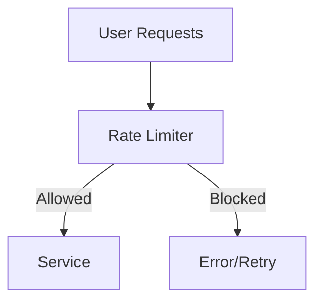
```
**Real-World Example:** API gateways like Kong and AWS API Gateway implement rate limiting for public APIs.
**When to Use:** API gateways, public APIs, resource protection.
**When Not to Use:** Internal services, predictable load.
**Alternatives:** Throttling, backpressure, quotas.
**Anti-Patterns:** Setting rate limits too low can block legitimate users; too high can allow abuse.
**Common Interview Questions:**
- How does the token bucket algorithm work?
  - *Answer:* The token bucket algorithm allows requests as long as tokens are available in the bucket. Tokens are added at a fixed rate, and each request consumes a token. If the bucket is empty, requests are limited or delayed, allowing for bursts up to the bucket size.
- How do you implement distributed rate limiting?
  - *Answer:* Use a centralized store (e.g., Redis) to track tokens or counters across nodes, or use distributed algorithms like consistent hashing and gossip to synchronize state. Ensure atomic updates to avoid race conditions.
- What are the trade-offs of different rate limiting algorithms?
  - *Answer:* Token bucket allows bursts, leaky bucket smooths traffic, and fixed window is simple but can cause spikes at window boundaries. Choose based on traffic patterns and fairness requirements.
- How do you handle rate limit errors gracefully?
  - *Answer:* Return appropriate HTTP status codes (e.g., 429), include retry-after headers, and provide clear error messages to clients.

## 13. Circuit Breaker Pattern
**Explanation:** Prevents system overload by blocking calls to failing services. Allows recovery and fallback. Protects systems from cascading failures.

**Diagram:**
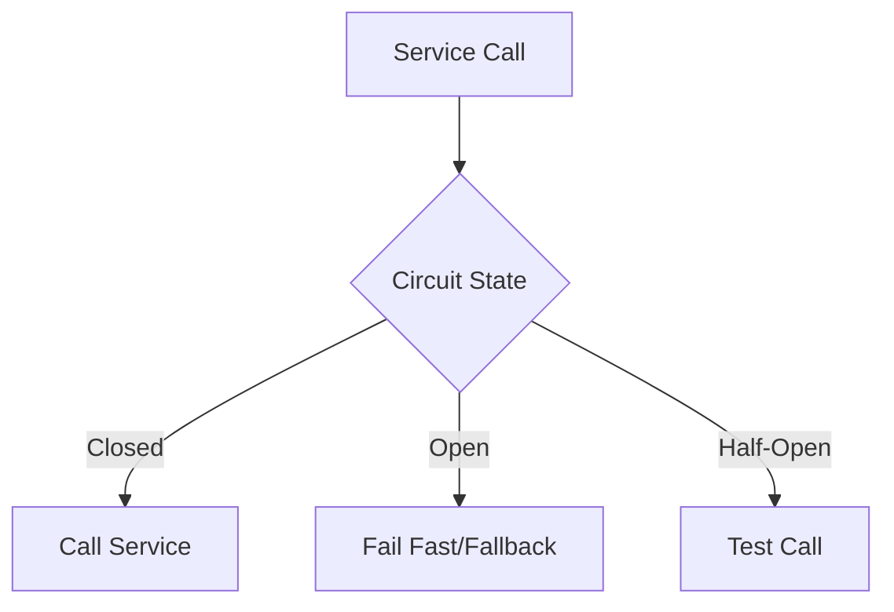
```
**Real-World Example:** Netflix Hystrix implements circuit breakers for microservices resilience.
**When to Use:** Microservices, external API calls, unreliable dependencies.
**When Not to Use:** Simple monoliths, critical operations without fallback.
**Alternatives:** Timeouts, retries, bulkhead pattern.
**Anti-Patterns:** Not resetting the circuit breaker can cause permanent service unavailability.
**Common Interview Questions:**
- How does a circuit breaker transition between states?
  - *Answer:* A circuit breaker starts in the closed state, allowing calls. If failures exceed a threshold, it opens, blocking calls. After a timeout, it enters half-open, allowing limited test calls. If successful, it closes; if not, it reopens.
- What is the difference between circuit breaker and retry logic?
  - *Answer:* Retry logic attempts failed calls again, while a circuit breaker blocks calls to a failing service to prevent overload. Circuit breakers protect systems from cascading failures, retries can exacerbate them if not controlled.
- How do you test circuit breaker effectiveness?
  - *Answer:* Simulate failures, monitor state transitions, and verify fallback logic. Use metrics to track open/close events and ensure the system recovers as expected.
- When should you use a circuit breaker?
  - *Answer:* Use circuit breakers when calling unreliable or slow dependencies, especially in distributed systems where failures can cascade.

## 14. Bulkhead Pattern
**Explanation:** Isolates resources to prevent one failing component from affecting others. Limits concurrent calls per resource. Improves system resilience.

**Diagram:**
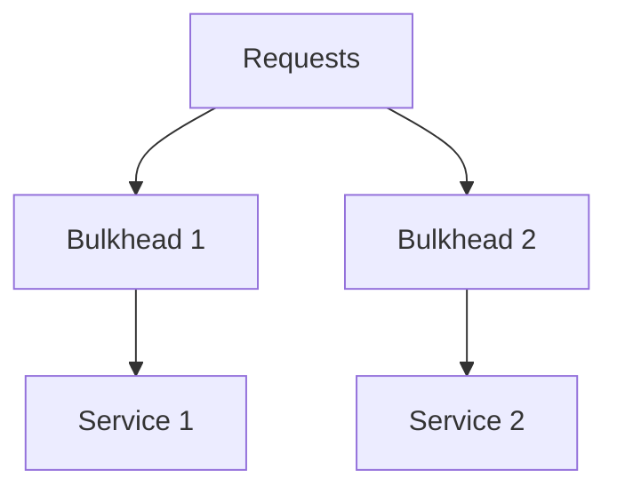
```
**Real-World Example:** Thread pools in Java limit the impact of slow tasks on overall system throughput.
**When to Use:** Shared resources, critical/non-critical operation separation.
**When Not to Use:** Simple apps, well-segregated infrastructure.
**Alternatives:** Thread pools, connection pools, semaphores.
**Anti-Patterns:** Not tuning bulkhead limits can lead to resource starvation or underutilization.
**Common Interview Questions:**
- How do you implement the bulkhead pattern?
  - *Answer:* Use separate thread pools, queues, or connection pools for different resources or service areas. This ensures that if one pool is exhausted, it does not affect others.
- What are the trade-offs of bulkheads vs. circuit breakers?
  - *Answer:* Bulkheads isolate failures to specific components, while circuit breakers block calls to failing services. Bulkheads prevent resource exhaustion, circuit breakers prevent cascading failures. Both can be used together for resilience.
- When would you use bulkheads in microservices?
  - *Answer:* Use bulkheads when services share critical resources (e.g., database connections) or when you want to isolate critical and non-critical operations to prevent one from starving the other.
- How do you tune bulkhead limits?
  - *Answer:* Monitor resource usage and adjust pool sizes based on load patterns, criticality, and desired isolation. Use metrics to detect saturation or underutilization.

## 15. Blue-Green Deployment
**Explanation:** Maintains two production environments for zero-downtime deployments and quick rollback. Reduces deployment risk and enables fast recovery.

**Diagram:**
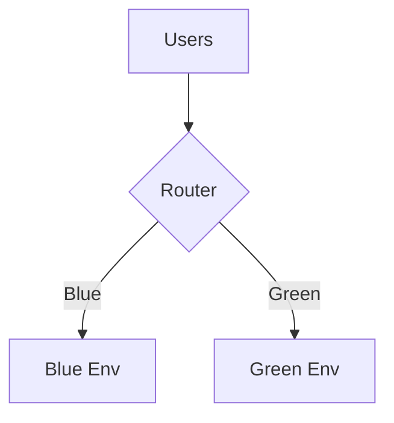
**Real-World Example:** E-commerce platforms use blue-green deployments to avoid downtime during major releases.
**When to Use:** Critical systems, zero-downtime requirements, fast rollback.
**When Not to Use:** Resource-constrained environments, simple apps.
**Alternatives:** Canary deployment, rolling updates, feature toggles.
**Anti-Patterns:** Not synchronizing databases between blue and green environments can cause data inconsistency.
**Common Interview Questions:**
- How do you switch traffic between blue and green environments?
  - *Answer:* Use a load balancer or DNS switch to redirect user traffic from the blue environment to the green environment (or vice versa) after verifying the new version is healthy.
- What are the risks of blue-green deployment?
  - *Answer:* Risks include data drift if databases are not synchronized, increased infrastructure costs, and potential for user confusion if sessions are not migrated.
- How do you handle database migrations?
  - *Answer:* Use backward-compatible migrations, apply schema changes before switching, and ensure both environments can operate with the new schema during the transition.
- When would you prefer blue-green over canary deployment?
  - *Answer:* Prefer blue-green when you need instant rollback and can afford duplicate environments, or when you want to minimize exposure to new changes.

## 16. Canary Deployment
**Explanation:** Gradually rolls out changes to a subset of users before full deployment. Reduces risk and enables real-world testing.

**Diagram:**
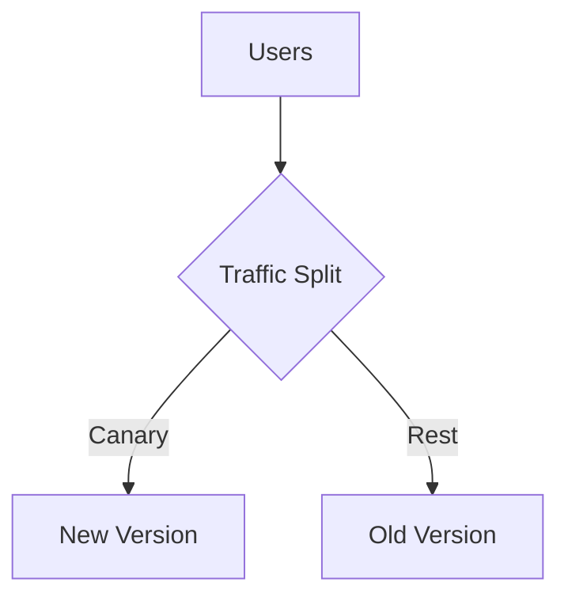
**Real-World Example:** Google uses canary releases for new features in Gmail and Search.
**When to Use:** Feature testing, risk minimization, performance testing.
**When Not to Use:** Features that can't be partially deployed, fast rollout needed.
**Alternatives:** Blue-green deployment, A/B testing, feature toggles.
**Anti-Patterns:** Not monitoring canary users can lead to undetected issues.
**Common Interview Questions:**
- How do you select canary users?
  - *Answer:* Select a representative sample of users based on demographics, usage patterns, or other criteria.
- What metrics do you monitor during a canary release?
  - *Answer:* Monitor key performance indicators (KPIs) such as response time, error rate, and user satisfaction.
- How do you automate rollback?
  - *Answer:* Implement automated rollback scripts that can be triggered based on certain conditions (e.g., high error rate, user complaints).
- When would you prefer canary deployment over blue-green?
  - *Answer:* Prefer canary deployment when you want to test a new feature with a small subset of users before rolling it out to all users, or when you want to minimize risk and impact on users.

## 17. Event Sourcing
**Explanation:** Stores state changes as a sequence of events. Enables audit trails and state reconstruction. Useful for complex business logic and debugging.

**Diagram:**
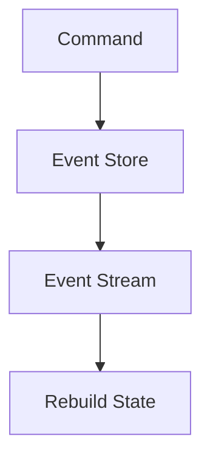
**Real-World Example:** Event sourcing is used in financial systems for transaction auditing.
**When to Use:** Audit requirements, complex business logic, debugging.
**When Not to Use:** Simple CRUD apps, high query performance needed.
**Alternatives:** CDC, traditional persistence.
**Anti-Patterns:** Not handling event versioning can break state reconstruction.
**Common Interview Questions:**
- How do you rebuild state from events?
  - *Answer:* Use event sourcing frameworks like Apache Kafka or Apache Flink to replay events and reconstruct state.
- What are the challenges of event sourcing?
  - *Answer:* Event sourcing can be complex and requires careful handling of event ordering and consistency.
- How do you handle event schema evolution?
  - *Answer:* Use versioning strategies like semantic versioning or event-driven migrations to handle changes to event schemas.
- When would you prefer event sourcing over CDC?
  - *Answer:* Prefer event sourcing when you need to maintain a complete history of state changes, or when you want to support complex business logic and debugging.

## 18. Feature Toggles
**Explanation:** Enables/disables features via configuration without redeploying code. Supports gradual rollouts and A/B testing. Useful for experimentation and emergency disables.

**Diagram:**
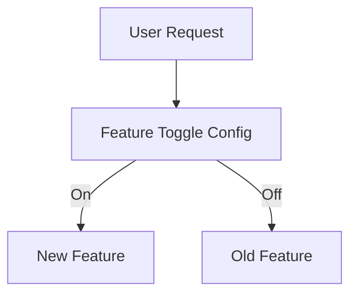
**Real-World Example:** Facebook uses feature toggles to test new features with a subset of users.
**When to Use:** Gradual rollouts, canary releases, emergency disables.
**When Not to Use:** Long-term feature differentiation, rarely changed toggles.
**Alternatives:** Branch deployments, versioned APIs.
**Anti-Patterns:** Leaving toggles in code long-term can increase technical debt.
**Common Interview Questions:**
- How do you manage toggle configuration at scale?
  - *Answer:* Use a centralized configuration management system like HashiCorp Consul or Apache Zookeeper.
- What are the risks of feature toggles?
  - *Answer:* Risks include data inconsistency if toggles are not applied consistently, increased complexity in code, and potential for bugs if toggles are not properly tested.
- How do you ensure toggle cleanup?
  - *Answer:* Implement automated tests to verify that toggles are not left in the codebase after they are no longer needed.
- When would you prefer feature toggles over branching?
  - *Answer:* Prefer feature toggles when you want to test small changes quickly without creating a new branch, or when you want to avoid the overhead of branching.

## 19. Consistent Hashing
**Explanation:** Distributes data across nodes with minimal rebalancing. Used in distributed caches and storage. Reduces impact of node addition/removal.

**Diagram:**
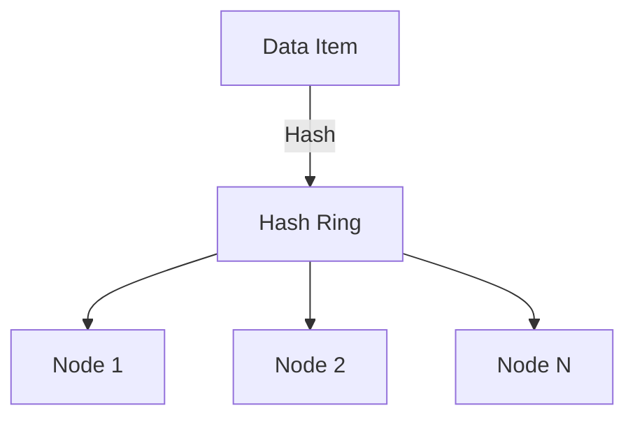
**Real-World Example:** Amazon Dynamo uses consistent hashing for partitioning.
**When to Use:** Distributed caching, CDNs, sharded databases.
**When Not to Use:** Static node sets, small-scale systems.
**Alternatives:** Modulo-based sharding, range partitioning.
**Anti-Patterns:** Not using virtual nodes can lead to uneven data distribution.
**Common Interview Questions:**
- How does consistent hashing handle node failures?
  - *Answer:* Consistent hashing rebalances data across nodes when a node is added or removed, minimizing the impact on the overall system.
- What are virtual nodes?
  - *Answer:* Virtual nodes are replicas of a physical node that are evenly distributed across the hash ring. This allows for more even distribution of data and load.
- How do you rebalance data?
  - *Answer:* When a node is added or removed, consistent hashing rebalances data by moving data from the affected node to the new node.
- When would you use consistent hashing over other hashing schemes?
  - *Answer:* Use consistent hashing when you need to distribute data evenly across nodes, or when you want to minimize the impact of node addition/removal.

## 20. Service Mesh
**Explanation:** Infrastructure layer for service-to-service communication, security, and observability. Examples: Istio, Linkerd. Provides traffic management, security, and monitoring.

**Diagram:**
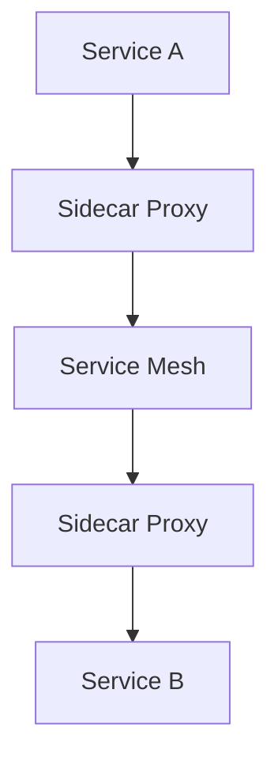
**Real-World Example:** Istio is used at scale for microservices traffic management at companies like Google.
**When to Use:** Microservices, complex networking, security needs.
**When Not to Use:** Monoliths, simple service architectures.
**Alternatives:** API gateways, custom middleware.
**Anti-Patterns:** Overcomplicating simple architectures with a service mesh can add unnecessary overhead.
**Common Interview Questions:**
- What problems does a service mesh solve?
  - *Answer:* A service mesh provides a way to manage service-to-service communication, security, and observability without requiring changes to the services themselves.
- How does Istio manage traffic routing?
  - *Answer:* Istio uses Envoy proxies to intercept traffic between services and apply policies like traffic splitting, retries, and circuit breakers.
- What are the trade-offs of using a service mesh?
  - *Answer:* Service meshes add complexity to the infrastructure but provide benefits like traffic management, security, and observability. They can also increase operational costs and require specialized expertise.
- When would you prefer a service mesh over an API gateway?
  - *Answer:* Prefer a service mesh when you need to manage traffic between services, enforce policies, or provide observability.

## 21. Data Streaming (Kafka, Kinesis)
**Explanation:** Real-time data pipelines for event-driven architectures. Supports high-throughput, low-latency messaging. Enables decoupling of producers and consumers.

**Diagram:**
```mermaid
graph TD;
  A[Producer] --> B[Kafka Cluster]
  B --> C[Consumer Group]
  C --> D[Message Processing]
```
**Real-World Example:** LinkedIn uses Kafka for activity stream processing.
**When to Use:** Real-time analytics, ETL, event-driven systems.
**When Not to Use:** Batch jobs, low-frequency updates.
**Alternatives:** RabbitMQ, ActiveMQ, traditional queues.
**Anti-Patterns:** Not handling backpressure can lead to data loss or system crashes.
**Common Interview Questions:**
- How does Kafka ensure message durability?
  - *Answer:* Kafka uses the "at least once" delivery semantics, which means that each message is delivered at least once, but may be delivered more than once.
- What is the difference between Kafka and RabbitMQ?
  - *Answer:* Kafka is a distributed streaming platform, while RabbitMQ is a message broker. Kafka is designed for high throughput and low latency, while RabbitMQ is designed for message queuing.
- How do you handle consumer lag?
  - *Answer:* Consumer lag can be monitored using Kafka's consumer lag metrics. If lag is high, it may indicate that the consumers are not keeping up with the producer rate.
- When would you prefer Kafka over RabbitMQ?
  - *Answer:* Prefer Kafka when you need high throughput, low latency, and the ability to replay messages.

## 22. Polyglot Persistence
**Explanation:** Uses multiple database types for different needs. Optimizes for diverse data models and access patterns. Increases flexibility but adds operational complexity.

**Diagram:**
```mermaid
graph TD;
  A[Application] --> B[Database 1]
  A --> C[Database 2]
  A --> D[Database N]
```
**Real-World Example:** Netflix uses Cassandra, MySQL, and Elasticsearch for different workloads.
**When to Use:** Microservices, diverse data requirements, performance optimization.
**When Not to Use:** Simple apps, operational complexity concerns.
**Alternatives:** Single database, multi-model databases.
**Anti-Patterns:** Not standardizing data access patterns can lead to maintenance challenges.
**Common Interview Questions:**
- How do you decide which database to use for a service?
  - *Answer:* Choose the database that best fits the application's requirements in terms of performance, consistency, and scalability.
- What are the challenges of polyglot persistence?
  - *Answer:* Polyglot persistence can lead to data inconsistency if not managed properly.
- How do you ensure data consistency?
  - *Answer:* Use eventual consistency models like Eventual Consistency for Collaborative Applications (EC2) or Conflict-free Replicated Data Types (CRDTs) for collaborative editing.
- When would you prefer polyglot persistence over monolithic databases?
  - *Answer:* Prefer polyglot persistence when you need to support multiple data models, or when you want to avoid vendor lock-in.

## 23. Multi-Tenancy
**Explanation:** Supports multiple customers (tenants) in a single system. Can be shared or isolated. Enables resource sharing and cost efficiency.

**Diagram:**
```mermaid
graph TD;
  A[Tenant 1] --> B[Tenant 1 Data]
  A --> C[Tenant 2]
  C --> D[Tenant 2 Data]
```
**Real-World Example:** Salesforce supports multi-tenancy for its SaaS platform.
**When to Use:** SaaS platforms, B2B products, resource sharing.
**When Not to Use:** Single-customer apps, strict isolation required.
**Alternatives:** Dedicated instances, containerization.
**Anti-Patterns:** Not isolating tenant data can lead to security breaches.
**Common Interview Questions:**
- What are the models of multi-tenancy?
  - *Answer:* Shared-nothing architecture, shared-database architecture, and multi-database architecture are common models.
- How do you ensure tenant data isolation?
  - *Answer:* Use database schemas, schemas, or database-level security to isolate tenant data.
- What are the trade-offs of shared vs. isolated tenancy?
  - *Answer:* Shared tenancy can reduce costs but may lead to resource contention and performance degradation. Isolated tenancy can increase costs but provides better isolation and performance.
- When would you prefer shared tenancy over isolated tenancy?
  - *Answer:* Prefer shared tenancy when you want to share resources among multiple tenants, or when you want to reduce costs.

## 24. Data Lake vs. Data Warehouse
**Explanation:** Data lakes store raw, unstructured data; warehouses store structured, processed data for analytics. Data lakes are flexible but require governance; warehouses are optimized for queries.

**Diagram:**
```mermaid
graph TD;
  A[Raw Data] --> B[Data Lake]
  A --> C[Structured Data]
  C --> D[Data Warehouse]
```
**Real-World Example:** AWS S3 as a data lake, Redshift as a data warehouse.
**When to Use:** Big data analytics, machine learning, reporting.
**When Not to Use:** Small datasets, real-time queries.
**Alternatives:** OLAP databases, NoSQL stores.
**Anti-Patterns:** Not enforcing schema in data lakes can lead to data swamp.
**Common Interview Questions:**
- What are the pros and cons of data lakes vs. warehouses?
  - *Answer:* Data lakes offer flexibility and cost-effectiveness but require governance. Warehouses are optimized for queries but may be less flexible.
- How do you migrate data between them?
  - *Answer:* Use ETL tools to move data from data lakes to warehouses, or use data virtualization to access both data sources as a single unified view.
- When would you use a hybrid approach?
  - *Answer:* Use a hybrid approach when you need to balance between the flexibility of data lakes and the performance of data warehouses.

## 25. Security and Compliance (OAuth, JWT, RBAC)
**Explanation:** Ensures secure access and compliance. OAuth for authorization, JWT for tokens, RBAC for role-based access. Critical for APIs and multi-user systems.

**Diagram:**
```mermaid
graph TD;
  A[User] --> B[Authentication]
  B --> C[Authorization]
  C --> D[API]
```
**Real-World Example:** Google APIs use OAuth2 and JWT for secure access.
**When to Use:** APIs, multi-user systems, sensitive data.
**When Not to Use:** Simple apps, internal tools.
**Alternatives:** Basic Auth, API keys, SAML.
**Anti-Patterns:** Storing JWT secrets in client-side code can lead to security breaches.
**Common Interview Questions:**
- How does OAuth2 work?
  - *Answer:* OAuth2 is an authorization framework that allows users to grant limited access to their resources without sharing their credentials.
- What are the risks of JWT?
  - *Answer:* JWT can be used for authentication and authorization but can also be intercepted and replayed.
- How do you implement RBAC at scale?
  - *Answer:* Use a centralized authorization service like Keycloak or Apache Knox.
- When would you prefer OAuth over Basic Auth?
  - *Answer:* Prefer OAuth when you need to support multiple authentication methods, or when you want to avoid exposing credentials in URLs.

## 26. Failure Detection and Recovery
**Explanation:** Detects and recovers from system failures. Heartbeats, health checks, and self-healing. Ensures high availability and resilience.

**Diagram:**
```mermaid
graph TD;
  A[Service] --> B[Health Check]
  B --> C[Monitoring]
  C --> D[Alerting]
```
**Real-World Example:** Kubernetes uses liveness and readiness probes for pod health.
**When to Use:** Distributed systems, high availability.
**When Not to Use:** Simple, single-node apps.
**Alternatives:** Manual monitoring, external watchdogs.
**Anti-Patterns:** Not automating recovery can increase downtime.
**Common Interview Questions:**
- How do you detect node failures?
  - *Answer:* Use tools like Prometheus or Grafana to monitor system health and alert on failures.
- What is the difference between liveness and readiness probes?
  - *Answer:* Liveness probes check if a container is running, while readiness probes check if a container is ready to serve traffic.
- How do you automate failover?
  - *Answer:* Use Kubernetes's built-in failover mechanisms like StatefulSets or custom scripts to promote standby instances.
- When would you prefer manual monitoring over automated tools?
  - *Answer:* Use manual monitoring when you need to perform custom checks or when the system is not fully containerized.

## 27. SLOs, SLIs, Error Budgets
**Explanation:** Service Level Objectives/Indicators and error budgets guide reliability and feature velocity. Used in SRE practices to balance innovation and stability.

**Diagram:**
```mermaid
graph TD;
  A[SLO] --> B[SLI]
  B --> C[Error Budget]
  C --> D[Release Planning]
```
**Real-World Example:** Google SRE uses error budgets to manage reliability.
**When to Use:** Production systems, reliability engineering.
**When Not to Use:** Non-critical apps, prototypes.
**Alternatives:** Informal monitoring, manual tracking.
**Anti-Patterns:** Not enforcing error budgets can lead to reliability degradation.
**Common Interview Questions:**
- What is an error budget?
  - *Answer:* An error budget is a predefined limit on the number of errors or downtime that a service can tolerate before it is considered to be in a degraded state.
- How do you define SLIs and SLOs?
  - *Answer:* SLIs are specific metrics that indicate whether a service is meeting its performance goals, while SLOs are high-level goals that services aim to achieve.
- How do you use error budgets in release planning?
  - *Answer:* Use error budgets to set limits on the number of errors or downtime that can occur during a release.
- When would you prefer informal monitoring over formal SLOs?
  - *Answer:* Use informal monitoring when you need to quickly identify and resolve issues, or when the system is not yet mature enough to have formal SLOs.

## 28. Monitoring and Observability (Tracing, Metrics, Logging)
**Explanation:** Tracks system health and performance. Distributed tracing, metrics, and logs provide visibility. Enables debugging and performance optimization.

**Diagram:**
```mermaid
graph TD;
  A[Application] --> B[Tracing]
  A --> C[Metrics]
  A --> D[Logging]
```
**Real-World Example:** Uber uses Jaeger for distributed tracing in microservices.
**When to Use:** Microservices, production systems, debugging.
**When Not to Use:** Simple apps, development environments.
**Alternatives:** APM tools, custom logging.
**Anti-Patterns:** Not correlating logs, metrics, and traces can hinder root cause analysis.
**Common Interview Questions:**
- How do you implement distributed tracing?
  - *Answer:* Use a distributed tracing tool like Jaeger or Zipkin to trace requests across services.
- What are the key metrics to monitor in a web service?
  - *Answer:* Key metrics include response time, error rate, throughput, and resource usage.
- How do you handle high-cardinality logs?
  - *Answer:* Use log aggregation tools like Fluentd or Logstash to process and analyze logs.
- When would you prefer custom logging over APM tools?
  - *Answer:* Use custom logging when you need to log custom events or when the system is not yet instrumented with APM tools.

## 29. Idempotency
**Explanation:** Ensures operations can be retried safely without side effects. Critical for payments, order processing, and APIs.

**Diagram:**
```mermaid
graph TD;
  A[Request] --> B[Idempotency Key]
  B --> C[Service]
  C --> D[Retry]
```
**Real-World Example:** Payment gateways use idempotency keys to prevent duplicate charges.
**When to Use:** Financial transactions, API operations, retry logic.
**When Not to Use:** Read operations, operations where retries should count as new requests.
**Alternatives:** Client-side tracking, natural idempotency.
**Anti-Patterns:** Not generating unique idempotency keys can lead to duplicate processing.
**Common Interview Questions:**
- How do you implement idempotency in REST APIs?
  - *Answer:* Use idempotent HTTP methods (GET, PUT, DELETE) and include a unique idempotency key in the request.
- What are natural idempotent operations?
  - *Answer:* Operations that can be safely retried without changing the state of the system.
- How do you handle idempotency in distributed systems?
  - *Answer:* Use distributed locks or idempotent consumers to ensure that operations are only executed once.
- When would you prefer client-side tracking over server-side tracking?
  - *Answer:* Use client-side tracking when you want to avoid the overhead of server-side tracking, or when you want to track idempotency across multiple services.

## 30. API Versioning
**Explanation:** Strategies for evolving APIs without breaking clients. Path, header, or media type versioning. Ensures backward compatibility and smooth evolution.

**Diagram:**
```mermaid
graph TD;
  A[API] --> B[Version 1]
  A --> C[Version 2]
  A --> D[Version N]
```
**Real-World Example:** Stripe uses path-based versioning for its public APIs.
**When to Use:** Public APIs, backward compatibility, evolving products.
**When Not to Use:** Internal APIs, stable requirements.
**Alternatives:** Hypermedia APIs, forward-compatible design.
**Anti-Patterns:** Not deprecating old versions can lead to maintenance burden.
**Common Interview Questions:**
- What are the pros and cons of different API versioning strategies?
  - *Answer:* Path-based versioning is simple but can lead to version proliferation. Header-based versioning is more flexible but can be harder to implement. Media type versioning is the most flexible but can be harder to implement correctly.
- How do you deprecate old API versions?
  - *Answer:* Use a deprecation policy and include a "deprecated" flag in the API response.
- How do you ensure backward compatibility?
  - *Answer:* Use versioning strategies that allow for gradual changes, such as header-based versioning or media type versioning.
- When would you prefer path-based versioning over header-based versioning?
  - *Answer:* Prefer path-based versioning when you want to avoid version proliferation, or when you want to make it clear which version of the API is being used.

---

# 30 More Advanced System Design Concepts for MAANG L5/L6

## 31. Global Distributed Databases
**Explanation:** Databases that span multiple geographic regions, providing low-latency access and high availability (e.g., Google Spanner, Cosmos DB).

**Diagram:**
```mermaid
graph TD;
  A[User - US] --> B[US Region]
  A2[User - EU] --> C[EU Region]
  B & C --> D[Global DB]
  D -->|Sync| B
  D -->|Sync| C
```
**Real-World Example:** Google Spanner provides globally consistent, distributed transactions across continents.
**When to Use:** Multi-region SaaS, global e-commerce, financial services.
**When Not to Use:** Using global databases for small-scale apps increases cost and complexity.
**Alternatives:** Regional replication, CDN caching.
**Anti-Patterns:** Using global databases for small-scale apps increases cost and complexity.
**Common Interview Questions:**
- How does Spanner achieve global consistency?
  - *Answer:* Spanner uses a distributed database architecture with strong consistency and eventual consistency. It uses a combination of Paxos-based consensus and linearizable reads to achieve global consistency.
- What are the trade-offs of global vs. regional databases?
  - *Answer:* Global databases can provide low-latency access but may be more expensive and complex to manage. Regional databases can be cheaper and easier to manage but may have higher latency.

## 32. Leader Election Algorithms
**Explanation:** Algorithms (e.g., Bully, Raft) to select a coordinator in distributed systems.

**Diagram:**
```mermaid
graph TD;
  A[Node 1] --> B[Leader Election]
  A2[Node 2] --> B
  A3[Node 3] --> B
  B --> C[Leader]
```
**Real-World Example:** Zookeeper uses leader election for coordination in distributed systems.
**When to Use:** Distributed job scheduling, cluster management.
**When Not to Use:** Relying on a single leader for all operations can create bottlenecks.
**Alternatives:** Multi-leader, leaderless architectures.
**Anti-Patterns:** Relying on a single leader for all operations can create bottlenecks.
**Common Interview Questions:**
- How does the Bully algorithm work?
  - *Answer:* The Bully algorithm is a distributed algorithm for leader election in a ring network. It works by sending a message to the next node in the ring until it finds a node that is up and has not yet voted.
- What are the failure scenarios in leader election?
  - *Answer:* Failure scenarios include network partitions, node failures, and clock drift.
- When would you prefer multi-leader over leaderless architecture?
  - *Answer:* Prefer multi-leader architecture when you need to handle multiple simultaneous operations, or when you want to avoid single points of failure.
- What are the challenges of multi-leader architecture?
  - *Answer:* Multi-leader architecture can lead to split-brain scenarios if not implemented correctly.

## 33. Quorum-Based Replication
**Explanation:** Ensures consistency by requiring a majority of nodes to agree on operations (e.g., Cassandra, Dynamo).

**Diagram:**
```mermaid
graph TD;
  A[Write Request] --> B[Node 1]
  A --> C[Node 2]
  A --> D[Node 3]
  B & C & D --> E{Quorum}
  E --> F[Commit]
```
**Real-World Example:** Cassandra uses quorum reads/writes to balance consistency and availability.
**When to Use:** Distributed databases, blockchain.
**When Not to Use:** Setting quorum size too low can compromise consistency.
**Alternatives:** Master-slave replication, eventual consistency.
**Anti-Patterns:** Setting quorum size too low can compromise consistency.
**Common Interview Questions:**
- How do you calculate read/write quorums?
  - *Answer:* Read/write quorums are calculated based on the number of nodes in the cluster.
- What are the trade-offs of quorum-based systems?
  - *Answer:* Quorum-based systems can provide high availability and consistency but can also lead to increased write latency and reduced throughput.
- When would you prefer quorum-based replication over master-slave replication?
  - *Answer:* Prefer quorum-based replication when you need high availability and consistency, or when you want to avoid single points of failure.

## 34. Gossip Protocols
**Explanation:** Peer-to-peer communication for state dissemination and failure detection (e.g., Cassandra, Consul).

**Diagram:**
```mermaid
graph TD;
  A[Node 1] -- Gossip --> B[Node 2]
  B -- Gossip --> C[Node 3]
  C -- Gossip --> D[Node 4]
  D -- Gossip --> A
```
**Real-World Example:** Consul uses gossip for cluster membership and health checking.
**When to Use:** Cluster membership, service discovery.
**When Not to Use:** Using gossip for high-frequency, low-latency updates.
**Alternatives:** Centralized registries, heartbeats.
**Anti-Patterns:** Using gossip for high-frequency, low-latency updates.
**Common Interview Questions:**
- How does gossip protocol scale?
  - *Answer:* Gossip protocols scale well with large clusters because each node only needs to communicate with a small subset of other nodes.
- What are the risks of gossip storms?
  - *Answer:* Gossip storms can lead to network congestion and increased latency if not implemented correctly.
- When would you prefer gossip over centralized registries?
  - *Answer:* Prefer gossip when you need low-latency communication and want to avoid a single point of failure.

## 35. Event-Driven Microservices
**Explanation:** Microservices communicate via events, enabling loose coupling and scalability.

**Diagram:**
```mermaid
graph TD;
  A[Service A] -- Event --> B[Message Broker]
  B --> C[Service B]
  B --> D[Service C]
```
**Real-World Example:** Uber uses event-driven microservices for trip and payment processing.
**When to Use:** E-commerce, IoT, real-time analytics.
**When Not to Use:** Overusing events for simple CRUD operations.
**Alternatives:** Synchronous APIs, monoliths.
**Anti-Patterns:** Overusing events for simple CRUD operations.
**Common Interview Questions:**
- How do you ensure event delivery guarantees?
  - *Answer:* Use message brokers like Apache Kafka or RabbitMQ to ensure reliable event delivery.
- What are the challenges of event-driven architectures?
  - *Answer:* Event-driven architectures can be complex to design and implement, especially when dealing with eventual consistency and distributed transactions.
- When would you prefer event-driven microservices over synchronous APIs?
  - *Answer:* Prefer event-driven microservices when you need to handle asynchronous communication, or when you want to avoid the overhead of synchronous APIs.

## 36. CQRS (Command Query Responsibility Segregation)
**Explanation:** Separates read and write models for scalability and flexibility.

**Diagram:**
```mermaid
graph TD;
  A[Command] --> B[Write Model]
  C[Query] --> D[Read Model]
  B & D --> E[Database]
```
**Real-World Example:** E-commerce platforms use CQRS for order management and reporting.
**When to Use:** Financial systems, audit trails.
**When Not to Use:** Using CQRS for simple CRUD apps.
**Alternatives:** CRUD, event sourcing.
**Anti-Patterns:** Using CQRS for simple CRUD apps.
**Common Interview Questions:**
- What are the benefits of CQRS?
  - *Answer:* CQRS can improve performance and scalability by separating read and write operations.
- How do you synchronize read and write models?
  - *Answer:* Use event sourcing or change data capture (CDC) to propagate changes from the write model to the read model.
- When would you prefer CQRS over CRUD?
  - *Answer:* Prefer CQRS when you need to support complex business logic and want to avoid the overhead of CRUD.

## 37. Saga Pattern
**Explanation:** Manages distributed transactions via a sequence of local transactions with compensating actions.

**Diagram:**
```mermaid
graph TD;
  A[Service 1] --> B[Service 2]
  B --> C[Service 3]
  C --> D[Compensating Action]
```
**Real-World Example:** Booking systems use sagas to coordinate payments, reservations, and notifications.
**When to Use:** E-commerce order processing, payment workflows.
**When Not to Use:** Using sagas for tightly coupled operations.
**Alternatives:** Two-phase commit, eventual consistency.
**Anti-Patterns:** Using sagas for tightly coupled operations.
**Common Interview Questions:**
- How do you handle failures in a saga?
  - *Answer:* Use compensation actions to undo failed transactions and ensure consistency.
- What is the difference between choreography and orchestration?
  - *Answer:* Choreography is about loosely coupled services coordinating with each other, while orchestration is about a central coordinator managing the flow of transactions.
- When would you prefer choreography over orchestration?
  - *Answer:* Prefer choreography when you want to avoid centralization and want to keep control with the services themselves.

## 38. Two-Phase Commit (2PC)
**Explanation:** Ensures atomicity across distributed systems via prepare and commit phases.

**Diagram:**
```mermaid
graph TD;
  A[Coordinator] --> B[Participant 1]
  A --> C[Participant 2]
  B & C --> D[Prepare]
  D --> E[Commit]
```
**Real-World Example:** Distributed databases use 2PC for atomic transactions across shards.
**When to Use:** Distributed databases, financial transactions.
**When Not to Use:** Using 2PC in high-latency or unreliable networks.
**Alternatives:** Sagas, eventual consistency.
**Anti-Patterns:** Using 2PC in high-latency or unreliable networks.
**Common Interview Questions:**
- What are the drawbacks of 2PC?
  - *Answer:* 2PC can lead to deadlock if not implemented correctly, and it can be slower than other consistency models.
- How do you handle coordinator failure?
  - *Answer:* Use a backup coordinator and a quorum of participants to ensure that the transaction can still proceed if the coordinator fails.
- When would you prefer 2PC over sagas?
  - *Answer:* Prefer 2PC when you need to ensure atomicity across multiple services, or when you want to avoid the complexity of sagas.

## 39. Distributed Tracing
**Explanation:** Tracks requests across microservices for debugging and performance analysis.

**Diagram:**
```mermaid
graph TD;
  A[User Request] --> B[Service A]
  B --> C[Service B]
  C --> D[Service C]
  D --> E[Trace Collector]
```
**Real-World Example:** Jaeger and Zipkin are popular distributed tracing systems.
**When to Use:** Microservices, cloud-native apps.
**When Not to Use:** Not correlating trace IDs across services.
**Alternatives:** Centralized logging, metrics.
**Anti-Patterns:** Not correlating trace IDs across services.
**Common Interview Questions:**
- How do you propagate trace context?
  - *Answer:* Use a distributed tracing tool like Jaeger or Zipkin to propagate trace context across services.
- What are the challenges of distributed tracing?
  - *Answer:* Distributed tracing can be complex to implement and may introduce overhead.
- When would you prefer distributed tracing over centralized logging?
  - *Answer:* Prefer distributed tracing when you need to trace requests across multiple services, or when you want to avoid the overhead of centralized logging.

## 40. Immutable Infrastructure
**Explanation:** Infrastructure is replaced, not modified, for deployments (e.g., AMIs, containers).

**Diagram:**
```mermaid
graph TD;
  A[Build Image] --> B[Deploy New Instance]
  B --> C[Replace Old Instance]
```
**Real-World Example:** Netflix uses immutable AMIs for EC2 deployments.
**When to Use:** Cloud deployments, CI/CD pipelines.
**When Not to Use:** Manual patching of servers.
**Alternatives:** Mutable infrastructure, configuration management.
**Anti-Patterns:** Manual patching of servers.
**Common Interview Questions:**
- What are the benefits of immutable infrastructure?
  - *Answer:* Immutable infrastructure can improve reliability and reduce the risk of configuration drift.
- How do you handle stateful services?
  - *Answer:* Use immutable infrastructure to avoid stateful services, or use immutable infrastructure with stateful services that are stateless.
- When would you prefer immutable infrastructure over mutable infrastructure?
  - *Answer:* Prefer immutable infrastructure when you want to avoid stateful services, or when you want to avoid configuration drift.

## 41. Infrastructure as Code (IaC)
**Explanation:** Managing infrastructure using code (e.g., Terraform, CloudFormation).

**Diagram:**
```mermaid
graph TD;
  A[Code] --> B[IaC Tool]
  B --> C[Provision Infra]
```
**Real-World Example:** Terraform is widely used for cloud infrastructure automation.
**When to Use:** Cloud automation, repeatable environments.
**When Not to Use:** Manual configuration drift.
**Alternatives:** Manual provisioning, scripts.
**Anti-Patterns:** Manual configuration drift.
**Common Interview Questions:**
- How do you manage secrets in IaC?
  - *Answer:* Use a secrets manager like HashiCorp Vault or AWS Secrets Manager.
- What are the risks of IaC?
  - *Answer:* Risks include configuration drift, security issues, and operational complexity.
- When would you prefer IaC over manual provisioning?
  - *Answer:* Prefer IaC when you want to ensure consistency across environments, or when you want to avoid manual configuration errors.

## 42. Zero Trust Security
**Explanation:** Security model where no user or device is trusted by default, even inside the network.

**Diagram:**
```mermaid
graph TD;
  A[User/Device] --> B[AuthN]
  B --> C[AuthZ]
  C --> D[Resource]
```
**Real-World Example:** Google BeyondCorp implements zero trust for enterprise security.
**When to Use:** Enterprise security, cloud-native apps.
**When Not to Use:** Relying solely on perimeter defenses.
**Alternatives:** Perimeter security, VPNs.
**Anti-Patterns:** Relying solely on perimeter defenses.
**Common Interview Questions:**
- How do you implement zero trust in microservices?
  - *Answer:* Implement zero trust principles like least privilege, least access, and least trust.
- What are the challenges of zero trust?
  - *Answer:* Zero trust can be complex to implement and may require changes to the organization's culture and processes.
- When would you prefer zero trust over perimeter security?
  - *Answer:* Prefer zero trust when you want to minimize the attack surface, or when you want to avoid the overhead of perimeter security.

## 43. Chaos Engineering
**Explanation:** Proactively injects failures to test system resilience (e.g., Netflix Chaos Monkey).

**Diagram:**
```mermaid
graph TD;
  A[System] --> B[Inject Failure]
  B --> C[Observe Behavior]
  C --> D[Improve Resilience]
```
**Real-World Example:** Netflix uses Chaos Monkey to randomly terminate instances in production.
**When to Use:** High-availability systems, cloud-native apps.
**When Not to Use:** Running chaos experiments in production without safeguards.
**Alternatives:** Manual failure testing, post-mortems.
**Anti-Patterns:** Running chaos experiments in production without safeguards.
**Common Interview Questions:**
- What is the goal of chaos engineering?
  - *Answer:* The goal of chaos engineering is to improve system resilience by identifying and mitigating potential failure points before they cause outages.
- How do you measure system resilience?
  - *Answer:* Use tools like Prometheus or Grafana to monitor system health and alert on failures.
- When would you prefer chaos engineering over manual testing?
  - *Answer:* Prefer chaos engineering when you want to test the system's resilience to unexpected failures, or when you want to avoid the overhead of manual testing.

## 44. Autoscaling
**Explanation:** Automatically adjusts resources based on load (e.g., AWS Auto Scaling, Kubernetes HPA).

**Diagram:**
```mermaid
graph TD;
  A[Monitor Metrics] --> B[Scaling Policy]
  B --> C[Add/Remove Instances]
```
**Real-World Example:** Kubernetes HPA scales pods based on CPU/memory usage.
**When to Use:** Cloud-native apps, cost optimization.
**When Not to Use:** Not setting scaling limits can lead to runaway costs.
**Alternatives:** Manual scaling, scheduled scaling.
**Anti-Patterns:** Not setting scaling limits can lead to runaway costs.
**Common Interview Questions:**
- How does Kubernetes HPA work?
  - *Answer:* Kubernetes HPA uses horizontal pod autoscaler (HPA) to automatically scale the number of replicas of a pod based on CPU or memory usage.
- What are the risks of autoscaling?
  - *Answer:* Risks include over-provisioning, under-provisioning, and potential for inconsistent performance.
- When would you prefer autoscaling over manual scaling?
  - *Answer:* Prefer autoscaling when you want to optimize resource usage and avoid over-provisioning.

## 45. Serverless Architectures
**Explanation:** Applications run in stateless compute containers managed by cloud providers (e.g., AWS Lambda).

**Diagram:**
```mermaid
graph TD;
  A[Event] --> B[Serverless Function]
  B --> C[Process/Return]
```
**Real-World Example:** AWS Lambda powers event-driven serverless applications.
**When to Use:** Event-driven apps, rapid prototyping.
**When Not to Use:** Using serverless for long-running or stateful workloads.
**Alternatives:** Containers, VMs.
**Anti-Patterns:** Using serverless for long-running or stateful workloads.
**Common Interview Questions:**
- What are the cold start issues in serverless?
  - *Answer:* Cold start issues can be mitigated by using pre-warming strategies like request-based scaling or pre-warming instances.
- How do you manage state in serverless apps?
  - *Answer:* Use serverless frameworks like AWS Lambda or Google Cloud Functions to manage state.
- When would you prefer serverless over containers?
  - *Answer:* Prefer serverless when you want to avoid the overhead of managing a server, or when you want to pay only for the resources you use.

## 46. Edge Computing
**Explanation:** Processing data closer to the source (edge) to reduce latency and bandwidth.

**Diagram:**
```mermaid
graph TD;
  A[IoT Device] --> B[Edge Node]
  B --> C[Cloud]
```
**Real-World Example:** Content delivery and IoT analytics often leverage edge computing.
**When to Use:** IoT, real-time analytics, AR/VR.
**When Not to Use:** Using edge for centralized, non-latency-sensitive workloads.
**Alternatives:** Cloud computing, CDN.
**Anti-Patterns:** Using edge for centralized, non-latency-sensitive workloads.
**Common Interview Questions:**
- What are the challenges of edge computing?
  - *Answer:* Challenges include limited processing power, limited network bandwidth, and security concerns.
- How do you ensure security at the edge?
  - *Answer:* Use encryption, authentication, and authorization mechanisms to secure data in transit and at rest.
- When would you prefer edge computing over cloud computing?
  - *Answer:* Prefer edge computing when you want to reduce latency and bandwidth, or when you want to minimize the impact of network congestion.

## 47. Data Anonymization and Privacy
**Explanation:** Techniques to protect sensitive data (e.g., masking, tokenization, differential privacy).

**Diagram:**
```mermaid
graph TD;
  A[Raw Data] --> B[Anonymization]
  B --> C[Masked Data]
```
**Real-World Example:** Healthcare systems anonymize patient data for research and compliance.
**When to Use:** GDPR compliance, healthcare, finance.
**When Not to Use:** Storing PII without anonymization.
**Alternatives:** Encryption, access controls.
**Anti-Patterns:** Storing PII without anonymization.
**Common Interview Questions:**
- What is differential privacy?
  - *Answer:* Differential privacy is a mathematical technique that ensures that the results of data analysis are robust to changes in individual data points.
- How do you anonymize data in real time?
  - *Answer:* Use data masking techniques to obscure sensitive data while still allowing useful analysis.
- When would you prefer differential privacy over encryption?
  - *Answer:* Prefer differential privacy when you want to protect data while still allowing useful analysis.

## 48. Data Lineage
**Explanation:** Tracking the origin and transformations of data for audit and debugging.

**Diagram:**
```mermaid
graph TD;
  A[Source] --> B[ETL]
  B --> C[Data Warehouse]
  C --> D[Analytics]
```
**Real-World Example:** Financial institutions track data lineage for regulatory compliance.
**When to Use:** Data governance, compliance, debugging.
**When Not to Use:** Not tracking data transformations in ETL pipelines.
**Alternatives:** Manual documentation, metadata catalogs.
**Anti-Patterns:** Not tracking data transformations in ETL pipelines.
**Common Interview Questions:**
- How do you implement data lineage in ETL?
  - *Answer:* Use a data lineage tool like Apache Atlas or Confluence to document data flows and relationships.
- Why is data lineage important?
  - *Answer:* Data lineage is important for compliance, auditing, and debugging.
- When would you prefer manual documentation over automated tools?
  - *Answer:* Use manual documentation when you want to provide detailed explanations and context for data transformations.

## 49. Hybrid Cloud Architectures
**Explanation:** Combining on-premises and cloud resources for flexibility and compliance.

**Diagram:**
```mermaid
graph TD;
  A[On-Prem] --> B[Hybrid Cloud]
  C[Cloud] --> B
  B --> D[Unified Services]
```
**Real-World Example:** Banks use hybrid cloud to keep sensitive data on-premises while leveraging cloud scalability.
**When to Use:** Regulated industries, gradual cloud migration.
**When Not to Use:** Not synchronizing data between environments.
**Alternatives:** Full cloud, multi-cloud.
**Anti-Patterns:** Not synchronizing data between environments.
**Common Interview Questions:**
- What are the challenges of hybrid cloud?
  - *Answer:* Challenges include managing multiple cloud providers, ensuring consistency across environments, and dealing with vendor lock-in.
- How do you ensure consistency across environments?
  - *Answer:* Use a multi-region database like Google Spanner or a distributed data platform like Apache Cassandra.
- When would you prefer hybrid cloud over full cloud?
  - *Answer:* Prefer hybrid cloud when you want to keep sensitive data on-premises, or when you want to avoid the overhead of managing multiple cloud providers.

## 50. Multi-Cloud Strategies
**Explanation:** Using multiple cloud providers to avoid vendor lock-in and improve resilience.

**Diagram:**
```mermaid
graph TD;
  A[App] --> B[AWS]
  A --> C[GCP]
  A --> D[Azure]
  B & C & D --> E[Users]
```
```
**Real-World Example:** Enterprises use multi-cloud for disaster recovery and global reach.
**When to Use:** Disaster recovery, global reach.
**When Not to Use:** Overcomplicating architecture for minimal benefit.
**Alternatives:** Single cloud, hybrid cloud.
**Anti-Patterns:** Overcomplicating architecture for minimal benefit.
**Common Interview Questions:**
- How do you manage data consistency in multi-cloud?
  - *Answer:* Data consistency in multi-cloud can be managed using distributed databases with cross-region replication, conflict resolution strategies, and global transaction protocols. Some systems use eventual consistency, while others use strong consistency with consensus algorithms.
- What are the trade-offs of multi-cloud?
  - *Answer:* Multi-cloud increases resilience and reduces vendor lock-in but adds complexity in networking, security, monitoring, and data consistency. It can also increase operational costs and require specialized expertise.
- How do you handle failover between clouds?
  - *Answer:* Use DNS-based routing, global load balancers, and data replication to enable seamless failover. Regularly test failover procedures to ensure reliability.
- When would you prefer multi-cloud over single cloud?
  - *Answer:* Prefer multi-cloud when you want to avoid vendor lock-in, or when you want to distribute your workload across multiple cloud providers.

## 51. API Gateways
**Explanation:** Centralized entry point for APIs, handling routing, security, and monitoring (e.g., Kong, Apigee).

**Diagram:**
```mermaid
graph TD;
  A[Client] --> B[API Gateway]
  B --> C[Service 1]
  B --> D[Service 2]
  B --> E[Service N]
```
**Use Cases:** Microservices, public APIs.
**Anti-Patterns:** Overloading gateways with business logic.
**Alternatives:** Service mesh, direct service calls.
**Common Interview Questions:**
- What are the benefits of API gateways?
  - *Answer:* API gateways centralize authentication, rate limiting, logging, and routing, simplifying client interactions and improving security and observability. They also enable protocol translation and request aggregation.
- How do you handle authentication at the gateway?
  - *Answer:* Implement authentication at the gateway using OAuth, JWT, or API keys. The gateway validates credentials and forwards authenticated requests to backend services, reducing duplication of auth logic.
- What are the risks of putting too much logic in the gateway?
  - *Answer:* Overloading the gateway with business logic can create a bottleneck, reduce maintainability, and make scaling or updating services more difficult. Keep gateways focused on cross-cutting concerns.
- When would you prefer API gateways over service mesh?
  - *Answer:* Prefer API gateways when you want to centralize routing and security, or when you want to avoid the overhead of a service mesh.

## 52. WebSockets and Real-Time Communication
**Explanation:** Enables full-duplex communication for real-time apps (e.g., chat, gaming).

**Diagram:**
```mermaid
graph TD;
  A[Client] -- WebSocket --> B[Server]
  B -- Push --> A
```
```
**Use Cases:** Messaging, collaborative editing, live dashboards.
**Anti-Patterns:** Using WebSockets for simple request-response APIs.
**Alternatives:** Long polling, SSE.
**Common Interview Questions:**
- How do you scale WebSocket servers?
  - *Answer:* Use load balancers with sticky sessions, distribute connections across multiple servers, and use a shared pub/sub or message broker for cross-server communication.
- What are the challenges of real-time communication?
  - *Answer:* Challenges include connection management, handling network partitions, ensuring message ordering and delivery, and scaling to large numbers of concurrent connections.
- How do you handle authentication and authorization in WebSockets?
  - *Answer:* Authenticate during the initial HTTP handshake and use tokens or session IDs for ongoing authorization. Periodically revalidate tokens for long-lived connections.
- When would you prefer WebSockets over long polling?
  - *Answer:* Prefer WebSockets when you want to maintain a persistent connection for real-time communication, or when you want to avoid the overhead of polling.

## 53. Content Delivery Networks (CDN)
**Explanation:** Distributes content closer to users for faster access and reduced latency.

**Diagram:**
```mermaid
graph TD;
  A[Origin Server] --> B[CDN Edge Node]
  B --> C[User]
```
```
**Use Cases:** Video streaming, static assets, global apps.
**Anti-Patterns:** Serving dynamic, personalized content via CDN without cache invalidation.
**Alternatives:** Edge computing, direct server delivery.
**Common Interview Questions:**
- How does a CDN work?
  - *Answer:* A CDN caches content at edge nodes close to users. Requests are routed to the nearest edge, reducing latency and offloading the origin server. If content is not cached, the edge fetches it from the origin.
- How do you handle cache invalidation?
  - *Answer:* Use cache-control headers, purge APIs, or versioned URLs to invalidate or update cached content when the origin changes.
- What are the trade-offs of using a CDN?
  - *Answer:* CDNs improve performance and scalability but add complexity in cache management and may introduce consistency delays for rapidly changing content.
- When would you prefer CDN over direct server delivery?
  - *Answer:* Prefer CDN when you want to reduce latency and offload the origin server, or when you want to cache content closer to users.

## 54. Data Consistency Models
**Explanation:** Defines guarantees for data visibility (e.g., strong, eventual, causal consistency).

**Diagram:**
```mermaid
graph TD;
  A[Write] --> B[Replica 1]
  A --> C[Replica 2]
  B & C --> D[Consistency Model]
```
```
**Use Cases:** Distributed databases, collaborative apps.
**Anti-Patterns:** Assuming strong consistency in eventually consistent systems.
**Alternatives:** Linearizability, serializability.
**Common Interview Questions:**
- What is eventual consistency?
  - *Answer:* Eventual consistency means that, given enough time without new updates, all replicas will converge to the same value, but reads may be stale immediately after a write.
- How do you choose a consistency model?
  - *Answer:* Choose based on application requirements: strong consistency for correctness-critical apps, eventual for high availability, and causal for collaborative or social apps.
- What is the CAP theorem?
  - *Answer:* The CAP theorem states that a distributed system can only guarantee two of Consistency, Availability, and Partition tolerance at the same time.
- When would you prefer eventual consistency over strong consistency?
  - *Answer:* Prefer eventual consistency when you want to trade off consistency for availability and partition tolerance.

## 55. Time Synchronization in Distributed Systems
**Explanation:** Ensures clocks are synchronized for ordering events (e.g., NTP, logical clocks, vector clocks).

**Diagram:**
```mermaid
graph TD;
  A[Node 1] -- NTP --> B[Time Server]
  A2[Node 2] -- NTP --> B
  B --> C[Consistent Time]
```
```
**Use Cases:** Distributed databases, event ordering.
**Anti-Patterns:** Relying solely on system clocks for ordering.
**Alternatives:** Lamport clocks, hybrid logical clocks.
**Common Interview Questions:**
- How do you order events in distributed systems?
  - *Answer:* Use logical clocks (Lamport, vector clocks) to assign order to events, or rely on synchronized physical clocks for approximate ordering.
- What are the limitations of NTP?
  - *Answer:* NTP provides only approximate synchronization and can be affected by network delays or malicious time servers. It is not suitable for strict ordering.
- When would you use vector clocks?
  - *Answer:* Use vector clocks when you need to track causality and concurrency between events in distributed systems.
- When would you prefer vector clocks over logical clocks?
  - *Answer:* Prefer vector clocks when you want to track causality and concurrency between events in distributed systems.

## 56. Data Compression at Scale
**Explanation:** Reduces storage and bandwidth usage for large datasets (e.g., columnar compression, delta encoding).

**Diagram:**
```mermaid
graph TD;
  A[Raw Data] --> B[Compression Algorithm]
  B --> C[Compressed Data]
```
```
**Use Cases:** Big data, log storage, streaming.
**Anti-Patterns:** Compressing already compressed data.
**Alternatives:** Data deduplication, partitioning.
**Common Interview Questions:**
- How do you choose a compression algorithm?
  - *Answer:* Consider data type, required compression ratio, speed, and resource usage. For text, use gzip or Brotli; for columnar data, use Parquet or ORC.
- What are the trade-offs of compression?
  - *Answer:* Compression saves space and bandwidth but adds CPU overhead for encoding/decoding and may increase latency for real-time access.
- How do you handle compression in distributed systems?
  - *Answer:* Compress data before transmission or storage, and ensure all nodes use compatible algorithms. Monitor for bottlenecks in decompression.
- When would you prefer compression over encryption?
  - *Answer:* Prefer compression when you want to reduce storage and bandwidth usage, or when you want to avoid the overhead of encryption.

## 57. Secure Secret Management
**Explanation:** Securely storing and accessing secrets (e.g., HashiCorp Vault, AWS Secrets Manager).

**Diagram:**
```mermaid
graph TD;
  A[App] --> B[Secrets Manager]
  B --> C[Encrypted Store]
```
```
**Use Cases:** Cloud apps, CI/CD pipelines.
**Anti-Patterns:** Hardcoding secrets in code or config files.
**Alternatives:** Environment variables, encrypted files.
**Common Interview Questions:**
- How do you rotate secrets securely?
  - *Answer:* Use automated rotation policies, update applications to fetch new secrets, and revoke old ones. Integrate with secrets managers that support rotation APIs.
- What are the risks of poor secret management?
  - *Answer:* Risks include credential leaks, unauthorized access, compliance violations, and data breaches. Always audit and monitor secret access.
- How do you provide secrets to containers or serverless functions?
  - *Answer:* Inject secrets at runtime via environment variables, mounted files, or secrets APIs, never baking them into images.
- When would you prefer secrets managers over environment variables?
  - *Answer:* Prefer secrets managers when you want to manage secrets securely, or when you want to avoid hardcoding secrets in code.

## 58. Data Governance
**Explanation:** Policies and processes for managing data quality, security, and compliance.

**Diagram:**
```mermaid
graph TD;
  A[Data Source] --> B[Governance Policy]
  B --> C[Data Consumer]
```
```
**Use Cases:** Enterprises, regulated industries.
**Anti-Patterns:** Ignoring data governance in large organizations.
**Alternatives:** Ad-hoc data management.
**Common Interview Questions:**
- What are the pillars of data governance?
  - *Answer:* Data quality, security, privacy, compliance, and stewardship are key pillars. Effective governance ensures data is accurate, protected, and used responsibly.
- How do you enforce governance policies?
  - *Answer:* Use automated tools for data classification, access control, auditing, and policy enforcement. Regularly review and update policies.
- What are the challenges of data governance at scale?
  - *Answer:* Challenges include data silos, inconsistent policies, and balancing agility with compliance. Use centralized governance frameworks and cross-team collaboration.
- When would you prefer centralized governance over decentralized governance?
  - *Answer:* Prefer centralized governance when you want to ensure consistency across the organization, or when you want to avoid the overhead of decentralized governance.

## 59. Data Mesh
**Explanation:** Decentralized approach to data architecture, treating data as a product owned by teams.

**Diagram:**
```mermaid
graph TD;
  A[Domain Team 1] --> B[Data Product 1]
  A2[Domain Team 2] --> C[Data Product 2]
  B & C --> D[Data Platform]
```
```
**Use Cases:** Large enterprises, federated data platforms.
**Anti-Patterns:** Centralized data teams for all data domains.
**Alternatives:** Data lake, data warehouse.
**Common Interview Questions:**
- What is data mesh?
  - *Answer:* Data mesh is a decentralized data architecture where domain teams own, build, and operate their data products, supported by a self-serve data platform.
- How do you implement data mesh in practice?
  - *Answer:* Empower domain teams, standardize interfaces, provide platform tooling, and enforce governance. Foster a data product mindset.
- What are the benefits and challenges of data mesh?
  - *Answer:* Benefits include scalability and domain expertise; challenges include consistency, governance, and cross-team coordination.
- When would you prefer data mesh over data warehouse?
  - *Answer:* Prefer data mesh when you want to decentralize data ownership, or when you want to avoid the overhead of a centralized data warehouse.

## 60. Homomorphic Encryption
**Explanation:** Allows computation on encrypted data without decryption.

**Diagram:**
```mermaid
graph TD;
  A[Encrypted Input] --> B[Computation]
  B --> C[Encrypted Output]
```
```
**Use Cases:** Privacy-preserving analytics, healthcare, finance.
**Anti-Patterns:** Using for high-throughput, low-latency workloads due to performance overhead.
**Alternatives:** Secure enclaves, differential privacy.
**Common Interview Questions:**
- What is homomorphic encryption?
  - *Answer:* Homomorphic encryption allows computations to be performed directly on encrypted data, producing encrypted results that, when decrypted, match the result of operations on the plaintext.
- What are its practical limitations?
  - *Answer:* Fully homomorphic encryption is computationally expensive and slow, making it impractical for most real-time or large-scale applications today.
- When would you use partially homomorphic encryption?
  - *Answer:* Use partially homomorphic encryption when only specific operations (e.g., addition or multiplication) are needed on encrypted data, reducing overhead compared to fully homomorphic schemes.
- When would you prefer homomorphic encryption over encryption?
  - *Answer:* Prefer homomorphic encryption when you want to perform computations on encrypted data without decrypting it, or when you want to avoid the overhead of encryption.

## 61. Federated Learning
**Explanation:** Machine learning where models are trained across decentralized devices without sharing raw data.

**Diagram:**
```mermaid
graph TD;
  A[Device 1] --> B[Model Update]
  A2[Device 2] --> B
  B --> C[Central Server]
  C --> B
```
```
**Use Cases:** Mobile devices, privacy-sensitive applications.
**Anti-Patterns:** Centralizing data for training when privacy is a concern.
**Alternatives:** Centralized ML, transfer learning.
**Common Interview Questions:**
- How does federated learning preserve privacy?
  - *Answer:* Raw data never leaves the device; only model updates are sent to the central server, reducing the risk of data leakage.
- What are the challenges of federated learning?
  - *Answer:* Challenges include handling heterogeneous data, unreliable devices, communication costs, and ensuring model convergence.
- How do you aggregate model updates securely?
  - *Answer:* Use secure aggregation protocols and differential privacy to prevent reconstruction of individual data from updates.
- When would you prefer federated learning over centralized ML?
  - *Answer:* Prefer federated learning when you want to train models on decentralized data without sharing raw data, or when you want to avoid the overhead of centralized ML.

## 62. Secure Multi-Party Computation (SMPC)
**Explanation:** Enables parties to jointly compute a function over their inputs while keeping those inputs private.

**Diagram:**
```mermaid
graph TD;
  A[Party 1] --> B[SMPC Protocol]
  A2[Party 2] --> B
  B --> C[Joint Result]
```
```
**Use Cases:** Joint analytics, privacy-preserving protocols.
**Anti-Patterns:** Using SMPC for non-sensitive data due to complexity.
**Alternatives:** Homomorphic encryption, trusted execution environments.
**Common Interview Questions:**
- What is SMPC?
  - *Answer:* SMPC allows multiple parties to jointly compute a function over their private inputs without revealing those inputs to each other.
- Where is it used in practice?
  - *Answer:* Used in privacy-preserving analytics, auctions, and collaborative research where data privacy is critical.
- What are the performance considerations?
  - *Answer:* SMPC protocols are often slower and more resource-intensive than standard computation, so use them only when privacy requirements justify the overhead.
- When would you prefer SMPC over homomorphic encryption?
  - *Answer:* Prefer SMPC when you want to jointly compute a function over private inputs without revealing those inputs to each other, or when you want to avoid the overhead of homomorphic encryption.

## 63. Data Residency and Sovereignty
**Explanation:** Ensuring data is stored and processed in specific geographic locations for legal compliance.

**Diagram:**
```mermaid
graph TD;
  A[User Data] --> B[Region 1 Storage]
  A --> C[Region 2 Storage]
```
```
**Use Cases:** GDPR, financial services, healthcare.
**Anti-Patterns:** Ignoring local data laws in global deployments.
**Alternatives:** Global sharding, regional clouds.
**Common Interview Questions:**
- What is data residency?
  - *Answer:* Data residency refers to the physical or geographic location where data is stored and processed, often dictated by legal or regulatory requirements.
- How do you enforce data sovereignty?
  - *Answer:* Use region-specific storage, access controls, and compliance monitoring to ensure data does not leave required jurisdictions.
- What are the risks of non-compliance?
  - *Answer:* Non-compliance can result in legal penalties, loss of customer trust, and forced shutdowns in certain regions.
- When would you prefer data residency over data sovereignty?
  - *Answer:* Prefer data residency when you want to ensure that data is stored and processed in specific geographic locations, or when you want to avoid the overhead of managing multiple regions.

## 64. API Throttling and Quotas
**Explanation:** Limiting API usage per user or client to protect backend resources.

**Diagram:**
```mermaid
graph TD;
  A[Client] --> B[API Gateway]
  B --> C[Quota Manager]
  C --> D[Backend Service]
```
```
**Use Cases:** Public APIs, SaaS platforms.
**Anti-Patterns:** Not communicating limits to clients.
**Alternatives:** Rate limiting, backpressure.
**Common Interview Questions:**
- How do you implement API quotas?
  - *Answer:* Track usage per client in a central store, enforce limits at the gateway, and return appropriate error codes when limits are exceeded.
- What are the trade-offs of hard vs. soft limits?
  - *Answer:* Hard limits strictly enforce quotas but may disrupt user experience; soft limits allow temporary bursts but require monitoring and enforcement mechanisms.
- How do you communicate quotas to clients?
  - *Answer:* Use response headers, documentation, and developer dashboards to inform clients of their usage and remaining quota.
- When would you prefer hard limits over soft limits?
  - *Answer:* Prefer hard limits when you want to ensure that users do not exceed their quotas, or when you want to avoid the overhead of monitoring and enforcement.

## 65. Distributed Transaction Patterns
**Explanation:** Patterns for ensuring consistency across distributed systems (e.g., 2PC, Sagas, TCC).

**Diagram:**
```mermaid
graph TD;
  A[Service 1] --> B[Coordinator]
  B --> C[Service 2]
  B --> D[Service 3]
  C & D --> B
```
```
**Use Cases:** Financial systems, e-commerce.
**Anti-Patterns:** Using distributed transactions for all operations.
**Alternatives:** Eventual consistency, compensation.
**Common Interview Questions:**
- What is the TCC pattern?
  - *Answer:* Try-Confirm/Cancel (TCC) splits a transaction into three phases: try (reserve resources), confirm (commit), and cancel (rollback), allowing distributed coordination with compensation.
- How do you handle partial failures?
  - *Answer:* Use compensation actions, retries, and idempotency to ensure system consistency even if some participants fail.
- What are the trade-offs of 2PC vs. Sagas?
  - *Answer:* 2PC provides atomicity but can block on failures; Sagas are more resilient but require compensation logic and may allow intermediate states.
- When would you prefer 2PC over Sagas?
  - *Answer:* Prefer 2PC when you need to ensure atomicity across multiple services, or when you want to avoid the complexity of Sagas.

## 66. Data Tiering
**Explanation:** Storing data in different storage classes based on access frequency (e.g., hot, warm, cold storage).

**Diagram:**
```mermaid
graph TD;
  A[Hot Data] --> B[Fast Storage]
  A2[Warm Data] --> C[Medium Storage]
  A3[Cold Data] --> D[Cheap Storage]
```
```
**Use Cases:** Big data, archival, cost optimization.
**Anti-Patterns:** Keeping all data in expensive storage.
**Alternatives:** Data purging, compression.
**Common Interview Questions:**
- How do you implement data tiering?
  - *Answer:* Classify data by access patterns, migrate infrequently accessed data to cheaper storage, and automate movement based on policies.
- What are the trade-offs of tiered storage?
  - *Answer:* Tiering reduces costs but may increase access latency for cold data. It adds complexity in data management and retrieval.
- How do you decide when to move data between tiers?
  - *Answer:* Use access logs, time-based policies, or machine learning to predict and automate tier transitions.
- When would you prefer tiered storage over all-flash storage?
  - *Answer:* Prefer tiered storage when you want to balance costs and performance, or when you want to avoid the overhead of all-flash storage.

## 67. Service Discovery
**Explanation:** Mechanisms for services to find each other dynamically (e.g., Consul, Eureka, DNS-based).

**Diagram:**
```mermaid
graph TD;
  A[Service A] --> B[Service Registry]
  C[Service B] --> B
  D[Client] --> B
  B --> D
```
```
**Use Cases:** Microservices, dynamic environments.
**Anti-Patterns:** Hardcoding service endpoints.
**Alternatives:** Static configuration, manual updates.
**Common Interview Questions:**
- How does service discovery work in Kubernetes?
  - *Answer:* Kubernetes uses DNS and environment variables to expose service endpoints. The kube-dns or CoreDNS service maintains a registry of available services.
- What are the risks of dynamic discovery?
  - *Answer:* Risks include stale or incorrect registry data, race conditions during scaling, and increased complexity in monitoring and debugging.
- How do you ensure high availability in service discovery?
  - *Answer:* Use replicated registries, health checks, and fallback mechanisms to ensure clients can always find healthy services.
- When would you prefer static configuration over dynamic discovery?
  - *Answer:* Use static configuration when you want to avoid the overhead of dynamic discovery, or when you want to ensure consistency across environments.

## 68. API Composition and Aggregation
**Explanation:** Combining multiple API calls into a single response for efficiency.

**Diagram:**
```mermaid
graph TD;
  A[Client] --> B[Aggregator]
  B --> C[Service 1]
  B --> D[Service 2]
  C & D --> B
  B --> A
```
```
**Use Cases:** BFF (Backend for Frontend), mobile apps.
**Anti-Patterns:** Over-aggregating, leading to large payloads.
**Alternatives:** GraphQL, direct service calls.
**Common Interview Questions:**
- What is the BFF pattern?
  - *Answer:* Backend for Frontend (BFF) is a pattern where a dedicated backend service aggregates and tailors data for a specific client or UI, improving efficiency and flexibility.
- How do you handle partial failures in aggregation?
  - *Answer:* Return partial data with error metadata, use fallbacks, or retry failed calls. Communicate clearly to the client which parts failed.
- What are the performance considerations?
  - *Answer:* Parallelize backend calls, cache results, and minimize payload size to reduce latency and improve user experience.
- When would you prefer GraphQL over direct service calls?
  - *Answer:* Prefer GraphQL when you want to query multiple services in a single request, or when you want to avoid the overhead of multiple API calls.

## 69. GraphQL and Flexible APIs
**Explanation:** Query language for APIs allowing clients to specify data shape.

**Diagram:**
```mermaid
graph TD;
  A[Client] --> B[GraphQL Server]
  B --> C[Data Source 1]
  B --> D[Data Source 2]
```
```
**Use Cases:** Mobile, web apps, microservices.
**Anti-Patterns:** Using GraphQL for simple, static APIs.
**Alternatives:** REST, gRPC.
**Common Interview Questions:**
- What are the pros and cons of GraphQL?
  - *Answer:* Pros: flexible queries, reduced over-fetching, strong typing. Cons: complex caching, N+1 query problem, and more challenging authorization.
- How do you secure GraphQL APIs?
  - *Answer:* Use authentication, field-level authorization, query depth limiting, and validation to prevent abuse and data leaks.
- How do you handle the N+1 query problem?
  - *Answer:* Use data loaders or batch resolvers to aggregate queries and minimize database round-trips.
- When would you prefer GraphQL over REST?
  - *Answer:* Prefer GraphQL when you want to query multiple services in a single request, or when you want to avoid the overhead of multiple API calls.

## 70. Observability-Driven Development
**Explanation:** Building systems with observability in mind from the start (tracing, metrics, logs).

**Diagram:**
```mermaid
graph TD;
  A[App] --> B[Tracing]
  A --> C[Metrics]
  A --> D[Logging]
  B & C & D --> E[Observability Platform]
```
```
**Use Cases:** Microservices, cloud-native apps.
**Anti-Patterns:** Adding observability as an afterthought.
**Alternatives:** Ad-hoc monitoring.
**Common Interview Questions:**
- How do you design for observability?
  - *Answer:* Instrument code with structured logs, metrics, and distributed tracing from the start. Use correlation IDs and standardize telemetry across services.
- What are the pillars of observability?
  - *Answer:* The three pillars are logs, metrics, and traces. Together, they provide comprehensive visibility into system behavior.
- How do you use observability to improve reliability?
  - *Answer:* Use observability data to detect anomalies, debug issues, and inform SLOs and error budgets, enabling proactive reliability improvements.
- When would you prefer observability over monitoring?
  - *Answer:* Prefer observability when you want to proactively monitor system health and performance, or when you want to avoid the overhead of manual monitoring.

## 71. Write Sharding
**Explanation:** Distributes write operations across multiple nodes or partitions to avoid bottlenecks and improve throughput.

**Diagram:**
```mermaid
graph TD;
  A[Write Request] --> B{Shard Key}
  B -- Key 1 --> C[Writer 1]
  B -- Key 2 --> D[Writer 2]
  B -- Key N --> E[Writer N]
```
```
**Real-World Example:** Twitter uses write sharding to distribute tweet writes across multiple servers.
**When to Use:** High write throughput, hot-spot avoidance, horizontally scalable systems.
**When Not to Use:** Low write volume, simple single-node systems.
**Alternatives:** Read sharding, vertical scaling.
**Anti-Patterns:** Poor shard key selection leading to uneven load.
**Common Interview Questions:**
- How do you choose a shard key for write sharding?
  - *Answer:* The shard key should distribute writes evenly across all nodes, avoiding hot spots. Common choices include user ID, hash of the primary key, or time-based partitioning.
- What are the challenges of resharding?
  - *Answer:* Resharding requires redistributing data and updating routing logic, which can cause downtime or data inconsistency if not handled carefully.
- When would you prefer write sharding over read sharding?
  - *Answer:* Prefer write sharding when you want to distribute write operations evenly across nodes, or when you want to avoid hot spots.

## 72. Read Replicas
**Explanation:** Use of additional database replicas to serve read traffic, improving scalability and reducing load on the primary node.

**Diagram:**
```mermaid
graph TD;
  A[Primary DB] --> B[Read Replica 1]
  A --> C[Read Replica 2]
  D[App] -->|Reads| B
  D -->|Reads| C
  D -->|Writes| A
```
```
**Real-World Example:** MySQL and PostgreSQL support read replicas for scaling read-heavy workloads.
**When to Use:** Read-heavy applications, analytics, reporting.
**When Not to Use:** Write-heavy workloads, strong consistency requirements.
**Alternatives:** Caching, sharding.
**Anti-Patterns:** Stale reads due to replication lag.
**Common Interview Questions:**
- How do you handle replication lag in read replicas?
  - *Answer:* Use eventual consistency for non-critical reads, or direct critical reads to the primary. Monitor lag and adjust application logic as needed.
- What are the trade-offs of synchronous vs. asynchronous replication?
  - *Answer:* Synchronous replication ensures consistency but increases write latency. Asynchronous replication is faster but can result in stale reads.
- When would you prefer synchronous replication over asynchronous replication?
  - *Answer:* Prefer synchronous replication when you want to ensure consistency, or when you want to avoid the overhead of asynchronous replication.

## 73. Hot/Cold Standby
**Explanation:** Redundant systems that can take over in case of failure. Hot standby is always running and ready; cold standby requires startup time.

**Diagram:**
```mermaid
graph TD;
  A[Primary] --> B[Hot Standby]
  A --> C[Cold Standby]
  B & C --> D[Failover]
```
```
**Real-World Example:** Financial trading systems use hot standby for high availability.
**When to Use:** High availability, disaster recovery.
**When Not to Use:** Non-critical systems, cost-sensitive environments.
**Alternatives:** Active-active clustering, backups.
**Anti-Patterns:** Not testing failover regularly.
**Common Interview Questions:**
- What is the difference between hot and cold standby?
  - *Answer:* Hot standby is always running and can take over instantly; cold standby requires startup time and may have data lag.
- How do you ensure data consistency during failover?
  - *Answer:* Use synchronous replication or regular checkpoints to minimize data loss.
- When would you prefer hot standby over cold standby?
  - *Answer:* Prefer hot standby when you want to minimize downtime and ensure high availability.

## 74. Eventual Consistency
**Explanation:** Guarantees that, given enough time, all replicas will converge to the same value, but not immediately after a write.

**Diagram:**
```mermaid
graph TD;
  A[Write] --> B[Replica 1]
  A --> C[Replica 2]
  B & C --> D[Converge Over Time]
```
```
**Real-World Example:** Amazon DynamoDB uses eventual consistency for high availability.
**When to Use:** Distributed systems, high availability, partition tolerance.
**When Not to Use:** Strong consistency requirements, financial transactions.
**Alternatives:** Strong consistency, causal consistency.
**Anti-Patterns:** Assuming immediate consistency in eventually consistent systems.
**Common Interview Questions:**
- What are the trade-offs of eventual consistency?
  - *Answer:* Higher availability and partition tolerance, but reads may be stale and conflict resolution is needed.
- How do you resolve conflicts in eventually consistent systems?
  - *Answer:* Use last-write-wins, vector clocks, or application-level reconciliation.
- When would you prefer eventual consistency over strong consistency?
  - *Answer:* Prefer eventual consistency when you want to trade off consistency for availability and partition tolerance.

## 75. Multi-Region Failover
**Explanation:** Automatic or manual switching of traffic to another region in case of regional failure.

**Diagram:**
```mermaid
graph TD;
  A[Users] --> B[Region 1]
  A --> C[Region 2]
  B -- Failover --> C
```
```
**Real-World Example:** Netflix uses multi-region failover for global service availability.
**When to Use:** Mission-critical, global applications.
**When Not to Use:** Single-region deployments, low-availability requirements.
**Alternatives:** CDN, hybrid cloud.
**Anti-Patterns:** Not synchronizing data between regions.
**Common Interview Questions:**
- How do you keep data in sync across regions?
  - *Answer:* Use cross-region replication, conflict resolution, and regular consistency checks.
- What are the challenges of DNS-based failover?
  - *Answer:* DNS caching and propagation delays can cause traffic to be routed to failed regions for some time.
- When would you prefer multi-region failover over CDN?
  - *Answer:* Prefer multi-region failover when you want to minimize downtime and ensure high availability across multiple regions.

## 76. Distributed Rate Limiting
**Explanation:** Enforces rate limits across multiple nodes or services in a distributed system.

**Diagram:**
```mermaid
graph TD;
  A[User] --> B[API Gateway 1]
  A --> C[API Gateway 2]
  B & C --> D[Central Rate Limit Store]
```
```
**Real-World Example:** Cloudflare enforces distributed rate limits across its global edge network.
**When to Use:** Multi-node APIs, microservices, global platforms.
**When Not to Use:** Single-node systems, low traffic.
**Alternatives:** Local rate limiting, quotas.
**Anti-Patterns:** Inconsistent enforcement due to clock skew or network partition.
**Common Interview Questions:**
- How do you synchronize rate limits across nodes?
  - *Answer:* Use a centralized store (e.g., Redis) or distributed counters with strong consistency guarantees.
- What are the risks of distributed rate limiting?
  - *Answer:* Network partitions or clock skew can lead to inconsistent enforcement or abuse.
- When would you prefer distributed rate limiting over local rate limiting?
  - *Answer:* Prefer distributed rate limiting when you want to ensure consistent rate limits across multiple services, or when you want to avoid the overhead of local rate limiting.

## 77. API Gateway Aggregation
**Explanation:** Combines multiple backend service responses into a single API response for clients.

**Diagram:**
```mermaid
graph TD;
  A[Client] --> B[API Gateway]
  B --> C[Service 1]
  B --> D[Service 2]
  C & D --> B
  B --> A
```
```
**Real-World Example:** Netflix API Gateway aggregates data from dozens of microservices for its UI.
**When to Use:** Mobile apps, microservices, BFF (Backend for Frontend).
**When Not to Use:** Monoliths, simple APIs.
**Alternatives:** Direct service calls, GraphQL.
**Anti-Patterns:** Over-aggregation leading to large payloads and slow responses.
**Common Interview Questions:**
- How do you handle partial failures in aggregation?
  - *Answer:* Return partial data with error metadata, or use fallback values.
- What are the performance considerations?
  - *Answer:* Parallelize backend calls and cache results where possible.
- When would you prefer API gateway aggregation over direct service calls?
  - *Answer:* Prefer API gateway aggregation when you want to centralize routing and security, or when you want to avoid the overhead of multiple API calls.

## 78. Distributed Task Scheduling
**Explanation:** Assigns and manages tasks across multiple nodes, ensuring reliability and scalability.

**Diagram:**
```mermaid
graph TD;
  A[Task Queue] --> B[Worker 1]
  A --> C[Worker 2]
  A --> D[Worker N]
```
```
**Real-World Example:** Celery and Kubernetes Jobs distribute tasks across clusters.
**When to Use:** Batch processing, background jobs, distributed systems.
**When Not to Use:** Simple, single-node apps.
**Alternatives:** Cron jobs, monolithic schedulers.
**Anti-Patterns:** Not handling worker failures or retries.
**Common Interview Questions:**
- How do you ensure task reliability?
  - *Answer:* Use acknowledgments, retries, and dead-letter queues.
- How do you avoid duplicate task execution?
  - *Answer:* Use idempotency keys or distributed locks.
- When would you prefer distributed task scheduling over monolithic scheduling?
  - *Answer:* Prefer distributed task scheduling when you want to scale out your processing capacity, or when you want to avoid the overhead of a monolithic scheduler.

## 79. Distributed File Systems
**Explanation:** Store and manage files across multiple machines, providing redundancy and scalability.

**Diagram:**
```mermaid
graph TD;
  A[Client] --> B[Metadata Server]
  B --> C[Data Node 1]
  B --> D[Data Node 2]
  B --> E[Data Node N]
```
```
**Real-World Example:** HDFS and Google File System (GFS) are widely used distributed file systems.
**When to Use:** Big data, analytics, large-scale storage.
**When Not to Use:** Small-scale, single-server storage.
**Alternatives:** Object storage, NAS.
**Anti-Patterns:** Single metadata server as a bottleneck.
**Common Interview Questions:**
- How is data replicated in distributed file systems?
  - *Answer:* Data is split into blocks and replicated across multiple data nodes for fault tolerance.
- What are the trade-offs of block size?
  - *Answer:* Larger blocks reduce metadata overhead but can waste space for small files.
- When would you prefer distributed file systems over object storage?
  - *Answer:* Prefer distributed file systems when you want to avoid the overhead of object storage, or when you want to handle large datasets.

## 80. Distributed Object Storage
**Explanation:** Stores unstructured data as objects, each with metadata and a unique identifier, across distributed nodes.

**Diagram:**
```mermaid
graph TD;
  A[Client] --> B[Object Storage API]
  B --> C[Storage Node 1]
  B --> D[Storage Node 2]
  B --> E[Storage Node N]
```
```
**Real-World Example:** Amazon S3 and MinIO provide distributed object storage.
**When to Use:** Cloud storage, backups, media hosting.
**When Not to Use:** File system semantics, low-latency random access.
**Alternatives:** Distributed file systems, block storage.
**Anti-Patterns:** Using object storage for transactional workloads.
**Common Interview Questions:**
- How do you ensure durability in object storage?
  - *Answer:* Replicate objects across multiple nodes and regions, and use erasure coding.
- What are the consistency models?
  - *Answer:* Many object stores offer eventual consistency, but some support strong consistency for specific operations.
- When would you prefer object storage over distributed file systems?
  - *Answer:* Prefer object storage when you want to store unstructured data, or when you want to avoid the overhead of distributed file systems.

## 81. Distributed Ledger Technology (DLT)
**Explanation:** Decentralized database managed by multiple participants, often used for blockchain and secure transactions.

**Diagram:**
```mermaid
graph TD;
  A[Transaction] --> B[Block]
  B --> C[Distributed Ledger]
  C --> D[Consensus]
```
```
**Real-World Example:** Bitcoin and Ethereum use DLT for secure, decentralized transactions.
**When to Use:** Financial systems, supply chain, audit trails.
**When Not to Use:** High-throughput, low-latency requirements.
**Alternatives:** Centralized databases, distributed databases.
**Anti-Patterns:** Using DLT for non-trustless environments.
**Common Interview Questions:**
- How does consensus work in DLT?
  - *Answer:* Nodes agree on the order and validity of transactions using protocols like Proof of Work or Proof of Stake.
- What are the scalability challenges?
  - *Answer:* Throughput is limited by consensus protocols and block size.
- When would you prefer DLT over centralized databases?
  - *Answer:* Prefer DLT when you want to decentralize the control of data, or when you want to avoid the overhead of a centralized database.

## 82. Distributed Search Systems
**Explanation:** Index and search data across multiple nodes for scalability and fault tolerance.

**Diagram:**
```mermaid
graph TD;
  A[User Query] --> B[Query Router]
  B --> C[Search Node 1]
  B --> D[Search Node 2]
  B --> E[Search Node N]
  C & D & E --> F[Aggregate Results]
```
```
**Real-World Example:** Elasticsearch and Solr distribute search indexes across clusters.
**When to Use:** Large-scale search, analytics, log aggregation.
**When Not to Use:** Small datasets, simple search.
**Alternatives:** Single-node search, database LIKE queries.
**Anti-Patterns:** Not rebalancing shards as data grows.
**Common Interview Questions:**
- How do you handle index updates in distributed search?
  - *Answer:* Use near real-time indexing and background rebalancing.
- What are the trade-offs of sharding vs. replication?
  - *Answer:* Sharding improves scalability, replication improves availability and fault tolerance.
- When would you prefer sharding over replication?
  - *Answer:* Prefer sharding when you want to distribute read and write operations evenly across nodes, or when you want to avoid hot spots.

## 83. Distributed Consensus Without Leaders
**Explanation:** Achieves agreement among nodes without a single leader, improving fault tolerance and scalability.

**Diagram:**
```mermaid
graph TD;
  A[Node 1] -- Propose --> B[Node 2]
  B -- Propose --> C[Node 3]
  C -- Propose --> D[Node 4]
  D -- Propose --> A
  A & B & C & D --> E[Agreement]
```
```
**Real-World Example:** EPaxos and blockchain protocols use leaderless consensus.
**When to Use:** High-availability, decentralized systems.
**When Not to Use:** Simple coordination, low node count.
**Alternatives:** Leader-based consensus (Raft, Paxos).
**Anti-Patterns:** Increased message complexity and latency.
**Common Interview Questions:**
- What are the benefits of leaderless consensus?
  - *Answer:* No single point of failure, better load distribution.
- What are the challenges?
  - *Answer:* More complex algorithms and higher message overhead.
- When would you prefer leaderless consensus over leader-based consensus?
  - *Answer:* Prefer leaderless consensus when you want to avoid single points of failure, or when you want to avoid the overhead of leader-based consensus.

## 84. Distributed Lock-Free Data Structures
**Explanation:** Data structures that allow concurrent access without locks, improving performance and scalability.

**Diagram:**
```mermaid
graph TD;
  A[Thread 1] --> B[Lock-Free Queue]
  A2[Thread 2] --> B
  B --> C[Shared Data]
```
```
**Real-World Example:** Java's ConcurrentLinkedQueue is a lock-free data structure.
**When to Use:** High-concurrency, low-latency systems.
**When Not to Use:** Simple, low-concurrency workloads.
**Alternatives:** Lock-based data structures.
**Anti-Patterns:** ABA problem, memory reclamation issues.
**Common Interview Questions:**
- How do lock-free data structures avoid deadlocks?
  - *Answer:* They use atomic operations (CAS) instead of locks, so threads never block each other.
- What is the ABA problem?
  - *Answer:* A value changes from A to B and back to A, making it appear unchanged to a thread, which can cause bugs.
- When would you prefer lock-free data structures over lock-based data structures?
  - *Answer:* Prefer lock-free data structures when you want to avoid deadlocks, or when you want to avoid the overhead of locks.

## 85. Distributed Pub/Sub Systems
**Explanation:** Decouples publishers and subscribers, allowing asynchronous, scalable message delivery across distributed nodes.

**Diagram:**
```mermaid
graph TD;
  A[Publisher] --> B[Broker]
  B --> C[Subscriber 1]
  B --> D[Subscriber 2]
```
```
**Real-World Example:** Google Pub/Sub and Apache Kafka provide distributed pub/sub messaging.
**When to Use:** Event-driven architectures, notification systems.
**When Not to Use:** Synchronous, point-to-point communication.
**Alternatives:** Message queues, direct calls.
**Anti-Patterns:** Not handling slow consumers or message ordering.
**Common Interview Questions:**
- How do you ensure message delivery in pub/sub?
  - *Answer:* Use acknowledgments, retries, and dead-letter topics.
- How do you handle message ordering?
  - *Answer:* Use partitioning and sequence numbers.
- When would you prefer pub/sub over message queues?
  - *Answer:* Prefer pub/sub when you want to decouple producers and consumers, or when you want to avoid the overhead of message queues.

## 86. Distributed Transaction Logs
**Explanation:** Centralized or distributed logs that record all changes for recovery, replication, and auditing.

**Diagram:**
```mermaid
graph TD;
  A[Service] --> B[Transaction Log]
  B --> C[Replica 1]
  B --> D[Replica 2]
```
```
**Real-World Example:** Kafka and BookKeeper provide distributed transaction logs.
**When to Use:** Event sourcing, replication, recovery.
**When Not to Use:** Stateless services, non-critical data.
**Alternatives:** Local logs, database triggers.
**Anti-Patterns:** Log compaction or retention misconfiguration.
**Common Interview Questions:**
- How do you ensure log durability?
  - *Answer:* Replicate logs across nodes and use disk persistence.
- What is log compaction?
  - *Answer:* Removing obsolete or duplicate entries to save space.
- When would you prefer distributed transaction logs over local logs?
  - *Answer:* Prefer distributed transaction logs when you want to ensure consistency across multiple services, or when you want to avoid the overhead of local logs.

## 87. Distributed Caching with Write-Through/Write-Behind
**Explanation:** Write-through caches update the cache and backing store synchronously; write-behind caches update the store asynchronously.

**Diagram:**
```mermaid
graph TD;
  A[App] --> B[Cache]
  B --> C[DB]
  B -- Async (Write-Behind) --> C
  B -- Sync (Write-Through) --> C
```
```
**Real-World Example:** Redis and Memcached support write-through and write-behind caching.
**When to Use:** High read/write throughput, data durability.
**When Not to Use:** Strict consistency requirements.
**Alternatives:** Read-through cache, write-around cache.
**Anti-Patterns:** Data loss in write-behind if cache fails before flush.
**Common Interview Questions:**
- What are the trade-offs of write-through vs. write-behind?
  - *Answer:* Write-through is safer but slower; write-behind is faster but risks data loss.
- How do you ensure durability in write-behind caches?
  - *Answer:* Use persistent queues and regular flushes.
- When would you prefer write-through caching over write-behind caching?
  - *Answer:* Prefer write-through caching when you want to ensure consistency across multiple services, or when you want to avoid the overhead of write-behind caching.

## 88. Distributed Rate-Limited Queues
**Explanation:** Queues that enforce rate limits on message consumption across distributed consumers.

**Diagram:**
```mermaid
graph TD;
  A[Producer] --> B[Queue]
  B --> C[Consumer 1]
  B --> D[Consumer 2]
  B --> E[Rate Limiter]
```
```
**Real-World Example:** Cloud task queues (e.g., Google Cloud Tasks) support distributed rate limiting.
**When to Use:** API integrations, background jobs, throttled processing.
**When Not to Use:** Unthrottled, bursty workloads.
**Alternatives:** Unrestricted queues, manual throttling.
**Anti-Patterns:** Not coordinating rate limits across consumers.
**Common Interview Questions:**
- How do you coordinate rate limits in distributed queues?
  - *Answer:* Use a shared rate limiter or distributed token bucket algorithm.
- What are the risks of not rate-limiting consumers?
  - *Answer:* Overloading downstream systems or violating API quotas.
- When would you prefer distributed rate-limited queues over local rate limiting?
  - *Answer:* Prefer distributed rate-limited queues when you want to ensure consistent rate limits across multiple services, or when you want to avoid the overhead of local rate limiting.

## 89. Distributed Data Validation
**Explanation:** Ensures data integrity and correctness across distributed systems, often using checksums, hashes, or consensus.

**Diagram:**
```mermaid
graph TD;
  A[Node 1] --> B[Validation]
  A2[Node 2] --> B
  B --> C[Consensus/Hash Check]
```
```
**Real-World Example:** HDFS uses block checksums to validate data integrity across nodes.
**When to Use:** Data replication, backups, distributed storage.
**When Not to Use:** Small, single-node systems.
**Alternatives:** Application-level validation, periodic audits.
**Anti-Patterns:** Not validating data after transfer or replication.
**Common Interview Questions:**
- How do you validate data integrity in distributed storage?
  - *Answer:* Use checksums or hashes and compare them after transfer or replication.
- What are the trade-offs of frequent validation?
  - *Answer:* More frequent validation increases reliability but adds overhead.
- When would you prefer distributed data validation over application-level validation?
  - *Answer:* Prefer distributed data validation when you want to ensure consistency across multiple services, or when you want to avoid the overhead of application-level validation.

## 90. Distributed Data Migration
**Explanation:** Moving data between nodes, clusters, or data centers with minimal downtime and data loss.

**Diagram:**
```mermaid
graph TD;
  A[Source Cluster] --> B[Migration Tool]
  B --> C[Target Cluster]
```
```
**Real-World Example:** Online data migration tools (e.g., AWS DMS) support live migration with minimal downtime.
**When to Use:** Scaling, cloud migration, hardware upgrades.
**When Not to Use:** Static, unchanging datasets.
**Alternatives:** Offline migration, backup/restore.
**Anti-Patterns:** Not handling schema changes or data consistency.
**Common Interview Questions:**
- How do you minimize downtime during migration?
  - *Answer:* Use live replication, dual writes, and cutover windows.
- What are the risks of online migration?
  - *Answer:* Data inconsistency, missed updates, or schema drift.
- When would you prefer live migration over offline migration?
  - *Answer:* Prefer live migration when you want to minimize downtime and ensure data consistency.

## 91. Distributed Data Masking
**Explanation:** Obscures sensitive data in distributed systems for privacy and compliance, often at query or storage time.

**Diagram:**
```mermaid
graph TD;
  A[User Query] --> B[Masking Layer]
  B --> C[Data Store]
  C --> B --> A
```
```
**Real-World Example:** Financial and healthcare systems mask PII in distributed databases.
**When to Use:** Compliance, privacy, multi-tenant systems.
**When Not to Use:** Internal, trusted environments.
**Alternatives:** Encryption, anonymization.
**Anti-Patterns:** Masking only at the UI layer.
**Common Interview Questions:**
- How do you implement data masking in distributed queries?
  - *Answer:* Use masking functions at the database or middleware layer before returning results.
- What are the risks of incomplete masking?
  - *Answer:* Data leaks, compliance violations, or privacy breaches.
- When would you prefer data masking over encryption?
  - *Answer:* Prefer data masking when you want to obscure sensitive data while still allowing useful analysis.

## 92. Distributed Data Expiry/TTL
**Explanation:** Automatically deletes or archives data after a specified time-to-live (TTL) across distributed systems.

**Diagram:**
```mermaid
graph TD;
  A[Data Item] --> B[TTL Timer]
  B --> C[Expiry/Archive]
```
```
**Real-World Example:** Redis and Cassandra support TTL for automatic data expiry.
**When to Use:** Session data, logs, temporary storage.
**When Not to Use:** Permanent records, audit logs.
**Alternatives:** Manual cleanup, scheduled jobs.
**Anti-Patterns:** Not handling expired data references in application logic.
**Common Interview Questions:**
- How do you implement TTL in distributed databases?
  - *Answer:* Store expiration metadata and run background jobs to delete or archive expired data.
- What are the risks of aggressive TTL settings?
  - *Answer:* Premature data loss or unintentional deletion of important records.
- When would you prefer distributed data expiry over manual cleanup?
  - *Answer:* Prefer distributed data expiry when you want to ensure that data is automatically deleted after a certain period, or when you want to avoid the overhead of manual cleanup.

## 93. Distributed Data Encryption at Rest
**Explanation:** Encrypts data stored on disk across distributed nodes to protect against unauthorized access.

**Diagram:**
```mermaid
graph TD;
  A[Data] --> B[Encryption Layer]
  B --> C[Disk/Storage]
```
```
**Real-World Example:** Google Cloud and AWS encrypt data at rest by default in distributed storage.
**When to Use:** Sensitive data, compliance, cloud storage.
**When Not to Use:** Non-sensitive, public data.
**Alternatives:** Application-level encryption, in-transit encryption.
**Anti-Patterns:** Storing keys on the same node as encrypted data.
**Common Interview Questions:**
- How do you manage encryption keys in distributed systems?
  - *Answer:* Use centralized key management services (KMS) and rotate keys regularly.
- What are the performance impacts of encryption at rest?
  - *Answer:* Minimal with hardware acceleration, but can increase I/O latency.
- When would you prefer distributed data encryption over application-level encryption?
  - *Answer:* Prefer distributed data encryption when you want to encrypt data at rest across multiple nodes, or when you want to avoid the overhead of application-level encryption.

## 94. Distributed Data Encryption in Transit
**Explanation:** Encrypts data as it moves between nodes to prevent interception or tampering.

**Diagram:**
```mermaid
graph TD;
  A[Node 1] -- TLS/SSL --> B[Node 2]
```
```
**Real-World Example:** TLS is used for secure communication in distributed databases and microservices.
**When to Use:** Sensitive data, public networks, compliance.
**When Not to Use:** Isolated, private networks.
**Alternatives:** VPN, private links.
**Anti-Patterns:** Disabling certificate validation.
**Common Interview Questions:**
- How do you implement secure communication between nodes?
  - *Answer:* Use TLS/SSL with mutual authentication and certificate validation.
- What are the risks of self-signed certificates?
  - *Answer:* They can be spoofed, leading to man-in-the-middle attacks.
- When would you prefer encrypted communication over plaintext communication?
  - *Answer:* Prefer encrypted communication when you want to protect data in transit, or when you want to avoid the overhead of plaintext communication.

## 95. Distributed Data Auditing
**Explanation:** Tracks access and changes to data across distributed systems for compliance and security.

**Diagram:**
```mermaid
graph TD;
  A[User Action] --> B[Audit Log]
  B --> C[Analysis/Alerting]
```
```
**Real-World Example:** Financial and healthcare systems maintain distributed audit logs for compliance.
**When to Use:** Regulated industries, security-sensitive systems.
**When Not to Use:** Non-critical, internal systems.
**Alternatives:** Centralized logging, periodic reviews.
**Anti-Patterns:** Not correlating audit logs across nodes.
**Common Interview Questions:**
- How do you ensure audit log integrity?
  - *Answer:* Use append-only logs, cryptographic hashes, and regular verification.
- What are the challenges of distributed auditing?
  - *Answer:* Correlating events across nodes and ensuring log consistency.
- When would you prefer distributed auditing over centralized logging?
  - *Answer:* Prefer distributed auditing when you want to ensure consistency across multiple services, or when you want to avoid the overhead of centralized logging.

## 96. Distributed Data Versioning
**Explanation:** Maintains multiple versions of data across distributed systems for rollback, audit, or conflict resolution.

**Diagram:**
```mermaid
graph TD;
  A[Data Update] --> B[New Version]
  B --> C[Version History]
  C --> D[Rollback/Compare]
```
```
**Real-World Example:** S3 versioning and Git maintain distributed data versions.
**When to Use:** Rollback, audit, collaborative editing.
**When Not to Use:** Immutable or append-only data.
**Alternatives:** Snapshots, backups.
**Anti-Patterns:** Unbounded version growth.
**Common Interview Questions:**
- How do you manage storage for data versioning?
  - *Answer:* Use retention policies, compaction, or archiving old versions.
- What are the risks of not versioning data?
  - *Answer:* Irrecoverable data loss or inability to resolve conflicts.
- When would you prefer distributed data versioning over snapshots?
  - *Answer:* Prefer distributed data versioning when you want to maintain multiple versions of data across multiple services, or when you want to avoid the overhead of snapshots.

## 97. Distributed Data Snapshots
**Explanation:** Captures the state of distributed data at a point in time for backup, recovery, or cloning.

**Diagram:**
```mermaid
graph TD;
  A[Data Nodes] --> B[Snapshot Manager]
  B --> C[Snapshot Storage]
```
```
**Real-World Example:** Cassandra and HDFS support distributed snapshots for backup and restore.
**When to Use:** Backups, disaster recovery, testing.
**When Not to Use:** Real-time, high-frequency updates.
**Alternatives:** Incremental backups, replication.
**Anti-Patterns:** Not coordinating snapshots across nodes.
**Common Interview Questions:**
- How do you ensure consistency in distributed snapshots?
  - *Answer:* Use coordinated snapshot protocols or quiesce writes during snapshot.
- What are the trade-offs of full vs. incremental snapshots?
  - *Answer:* Full snapshots are simpler but slower and larger; incremental are faster and smaller but more complex.
- When would you prefer full snapshots over incremental snapshots?
  - *Answer:* Prefer full snapshots when you want to ensure consistency across all replicas, or when you want to avoid the overhead of incremental snapshots.

## 98. Distributed Data Compaction
**Explanation:** Periodically merges and reorganizes data in distributed storage to reclaim space and improve performance.

**Diagram:**
```mermaid
graph TD;
  A[Old Data Files] --> B[Compaction Process]
  B --> C[New Data Files]
```
```
**Real-World Example:** Cassandra and LevelDB use compaction to manage SSTables.
**When to Use:** Write-heavy, append-only storage.
**When Not to Use:** Read-heavy, static data.
**Alternatives:** Garbage collection, manual cleanup.
**Anti-Patterns:** Compaction storms causing performance degradation.
**Common Interview Questions:**
- How do you schedule compaction in distributed systems?
  - *Answer:* Use background jobs, rate limiting, and monitor system load.
- What are the risks of aggressive compaction?
  - *Answer:* Increased I/O, latency spikes, or data loss if interrupted.
- When would you prefer distributed data compaction over manual cleanup?
  - *Answer:* Prefer distributed data compaction when you want to optimize storage usage and avoid the overhead of manual cleanup.

## 99. Distributed Data Garbage Collection
**Explanation:** Automatically removes obsolete or deleted data from distributed storage to reclaim space.

**Diagram:**
```mermaid
graph TD;
  A[Obsolete Data] --> B[GC Process]
  B --> C[Free Space]
```
```
**Real-World Example:** Cassandra and HBase use tombstones and background GC for deleted data.
**When to Use:** Append-only, mutable storage.
**When Not to Use:** Immutable data, small datasets.
**Alternatives:** Manual cleanup, compaction.
**Anti-Patterns:** Not tuning GC intervals, leading to storage bloat.
**Common Interview Questions:**
- How do you avoid deleting live data during GC?
  - *Answer:* Use reference counting, grace periods, or version checks.
- What are the risks of infrequent GC?
  - *Answer:* Storage bloat, increased read latency, or out-of-space errors.
- When would you prefer distributed data garbage collection over manual cleanup?
  - *Answer:* Prefer distributed data garbage collection when you want to avoid the overhead of manual cleanup, or when you want to ensure that data is automatically removed after a certain period.

## 100. Distributed Data Federation
**Explanation:** Integrates data from multiple, autonomous sources into a unified view without centralizing storage.

**Diagram:**
```mermaid
graph TD;
  A[Source 1] --> B[Federation Layer]
  A2[Source 2] --> B
  B --> C[Unified Query]
```
```
**Real-World Example:** Presto and Trino provide distributed SQL queries across heterogeneous data sources.
**When to Use:** Data lakes, multi-cloud, hybrid environments.
**When Not to Use:** Homogeneous, centralized data.
**Alternatives:** ETL, data warehousing.
**Anti-Patterns:** Not handling schema or query translation.
**Common Interview Questions:**
- How do you handle schema differences in data federation?
  - *Answer:* Use schema mapping, transformation, or middleware adapters.
- What are the performance considerations?
  - *Answer:* Query pushdown, parallelism, and minimizing data movement are key for performance.
- When would you prefer distributed data federation over ETL?
  - *Answer:* Prefer distributed data federation when you want to query data from multiple sources without centralizing storage, or when you want to avoid the overhead of ETL.

---

This guide is intended for interview preparation and practical system design discussions at MAANG L5/L6 level. For implementation details, refer to official documentation and open-source projects.
