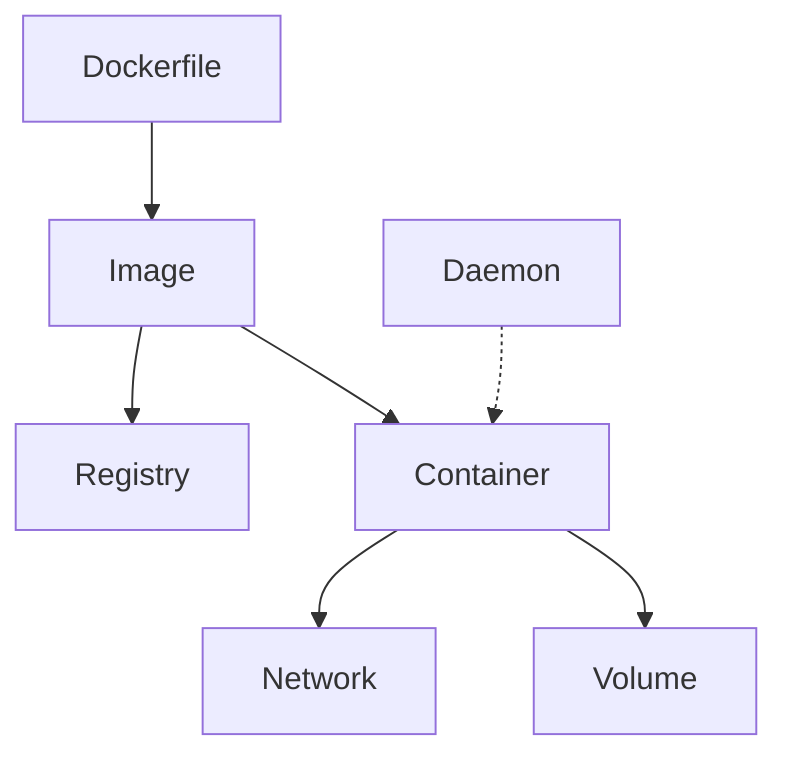

# Docker: MAANG Interview Prep Guide

## 1. Architecture & Core Concepts

### High-Level Architecture
- **Docker Daemon:** Background service managing containers.
- **Images:** Read-only templates for containers, built from Dockerfiles.
- **Containers:** Running instances of images, isolated from host.
- **Registries:** Store and distribute images (Docker Hub, private registries).
- **Networking:** Bridge, host, overlay, and custom networks.
- **Storage:** Volumes, bind mounts, tmpfs.

**Diagram:**

### Core Concepts
- **Layers:** Images are built in layers for efficiency and caching.
- **Volumes:** Persistent storage for containers.
- **Networking Modes:** Bridge (default), host, overlay, macvlan.
- **Dockerfile:** Script to build images (FROM, RUN, COPY, CMD, etc.).

### Lifecycle
- **Build:** `docker build` creates images from Dockerfile.
- **Run:** `docker run` starts containers from images.
- **Stop/Remove:** `docker stop`/`docker rm` manages container lifecycle.
- **Image Pull/Push:** `docker pull`/`docker push` for registry operations.

## 2. Interview Questions & Answers
- **Q:** How does Docker isolate containers?
  - *A:* Uses Linux namespaces (PID, network, mount, user) and cgroups for resource isolation. Each container has its own filesystem, network stack, and process tree.
- **Q:** What is the difference between a container and an image?
  - *A:* An image is a static, read-only template; a container is a running instance of an image with its own state and processes.
- **Q:** How do Docker volumes differ from bind mounts?
  - *A:* Volumes are managed by Docker and stored in a default location; bind mounts map host directories/files directly into the container. Volumes are preferred for portability and backup.
- **Q:** How does Docker networking work?
  - *A:* Docker creates a default bridge network for containers. Containers can communicate on the same network. Other modes (host, overlay) provide different isolation and connectivity.
- **Q:** How do you optimize Docker images for production?
  - *A:* Use multi-stage builds, minimize layers, use `.dockerignore`, and choose minimal base images (e.g., Alpine).
- **Q:** What is the difference between ENTRYPOINT and CMD in a Dockerfile?
  - *A:* ENTRYPOINT sets the main command to run, while CMD provides default arguments. CMD can be overridden at runtime; ENTRYPOINT is not.
- **Q:** How do you persist data in Docker containers?
  - *A:* By using Docker volumes or bind mounts to store data outside the container's writable layer.
- **Q:** What is the difference between COPY and ADD in Dockerfile?
  - *A:* Both copy files, but ADD can also extract tar archives and supports remote URLs. COPY is preferred for clarity unless you need ADD's features.
- **Q:** How do you reduce Docker image size?
  - *A:* Use smaller base images, multi-stage builds, combine RUN commands, clean up caches/artifacts, and use `.dockerignore`.
- **Q:** How do you handle secrets in Docker?
  - *A:* Use Docker secrets (in Swarm), environment variables (with caution), or external secret managers. Avoid hardcoding secrets in images.
- **Q:** How can you update a running container?
  - *A:* You cannot update a running container directly; instead, build a new image and run a new container, then remove the old one.
- **Q:** What is the difference between Docker Compose and Docker Swarm?
  - *A:* Compose is for defining and running multi-container apps on a single host; Swarm is for orchestrating containers across a cluster.
- **Q:** How do you debug a failing container?
  - *A:* Use `docker logs`, `docker exec` to get a shell, inspect container state, and check resource usage with `docker stats`.
- **Q:** What is the purpose of the `.dockerignore` file?
  - *A:* It excludes files and directories from the build context, reducing build time and image size.

## 3. Important Docker Commands
- **Build image:** `docker build -t myimage .`
- **Run container:** `docker run -d --name mycontainer myimage`
- **List containers:** `docker ps -a`
- **Exec into container:** `docker exec -it mycontainer /bin/sh`
- **View logs:** `docker logs mycontainer`
- **List images:** `docker images`
- **Remove container/image:** `docker rm mycontainer` / `docker rmi myimage`
- **Network commands:** `docker network ls`, `docker network inspect`, `docker network create`
- **Volume commands:** `docker volume ls`, `docker volume inspect`, `docker volume create`
- **Inspect:** `docker inspect mycontainer`
- **Prune unused:** `docker system prune`
- **Stop all containers:** `docker stop $(docker ps -q)`
- **Remove all containers:** `docker rm $(docker ps -aq)`
- **Remove all images:** `docker rmi $(docker images -q)`
- **Remove all unused volumes:** `docker volume prune`
- **Remove all unused networks:** `docker network prune`
- **Copy files from container:** `docker cp mycontainer:/path/in/container /host/path`
- **Save image to tar:** `docker save -o myimage.tar myimage`
- **Load image from tar:** `docker load -i myimage.tar`
- **Tag image:** `docker tag myimage myrepo/myimage:latest`
- **Login to registry:** `docker login`
- **Logout from registry:** `docker logout`
- **Update container resource limits:** `docker update --cpus 2 --memory 1g mycontainer`
- **Attach to running container:** `docker attach mycontainer`
- **Restart container:** `docker restart mycontainer`
- **Pause/unpause container:** `docker pause mycontainer` / `docker unpause mycontainer`
- **Show container events:** `docker events`
- **Show container diff:** `docker diff mycontainer`
- **Show container top:** `docker top mycontainer`
- **Show container stats:** `docker stats`
- **Show disk usage:** `docker system df`

## 4. Key Metrics for Fault Tolerance
- **Container Health:** Health checks (configured in Dockerfile/compose) indicate if a container is running as expected.
- **Resource Usage:** CPU, memory, disk, and network usage per container. High usage may indicate leaks or bottlenecks.
- **Restart Count:** Frequent restarts may indicate crashes or misconfiguration.

**Why Needed:**
- Detect failing containers, resource exhaustion, and performance issues early.

**Tools:**
- **docker stats:** Real-time resource usage.
- **cAdvisor:** Container monitoring.
- **Prometheus + Grafana:** For alerting and dashboards.