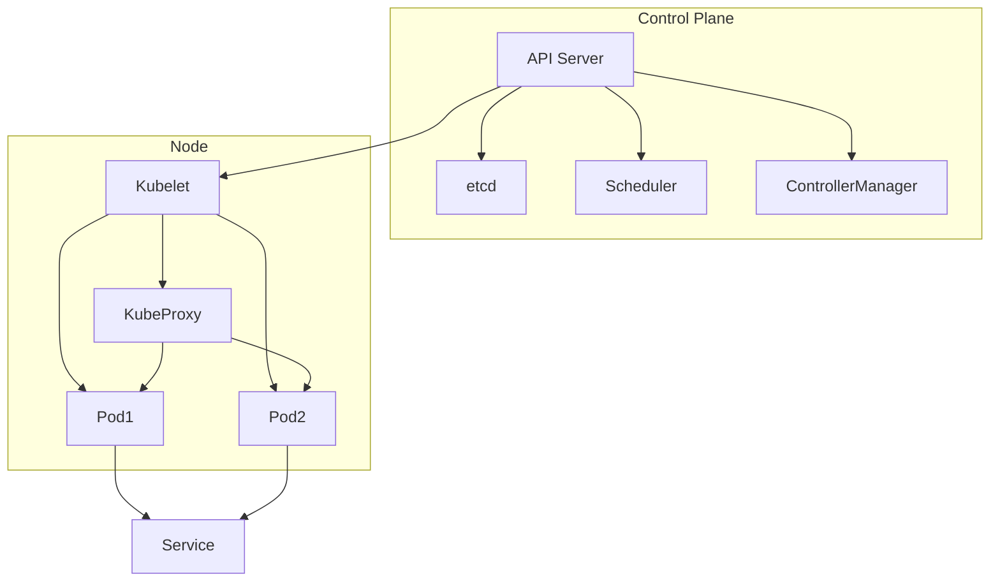

# Kubernetes (K8s): MAANG Interview Prep Guide

## 1. Architecture & Core Concepts

### High-Level Architecture
- **Control Plane (Master):** API server, etcd (key-value store), scheduler, controller manager.
- **Nodes (Workers):** Run pods via kubelet and kube-proxy.
- **Pods:** Smallest deployable unit, can contain one or more containers.
- **Deployments/ReplicaSets:** Manage pod scaling and rolling updates.
- **Services:** Expose pods (ClusterIP, NodePort, LoadBalancer, Ingress).
- **ConfigMaps/Secrets:** Store configuration and sensitive data.
- **Volumes:** Persistent storage for pods.
- **Namespaces:** Logical cluster segmentation.
- **RBAC:** Role-based access control for security.

**Diagram:**

### Core Concepts
- **Pods:** Group of containers sharing network/storage.
- **ReplicaSets:** Ensure a specified number of pod replicas.
- **Deployments:** Declarative updates for ReplicaSets.
- **Services:** Stable networking for pods.
- **ConfigMaps/Secrets:** Decouple config from code.
- **Volumes:** Persistent/ephemeral storage.
- **Namespaces:** Multi-tenancy and resource isolation.
- **RBAC:** Fine-grained access control.

### Lifecycle
- **Pod Scheduling:** Scheduler assigns pods to nodes based on resources/constraints.
- **Scaling:** Deployments/ReplicaSets scale pods up/down.
- **Rolling Updates:** Deployments update pods with zero downtime.
- **Self-Healing:** Failed pods are automatically restarted/replaced.

## 2. Interview Questions & Answers
- **Q:** How does Kubernetes achieve self-healing?
  - *A:* The controller manager monitors pod health and restarts or reschedules failed pods automatically. Deployments and ReplicaSets ensure the desired state is maintained.
- **Q:** What is the difference between a Deployment and a StatefulSet?
  - *A:* Deployments manage stateless pods with interchangeable replicas. StatefulSets manage stateful pods with stable identities and persistent storage.
- **Q:** How does Kubernetes handle service discovery?
  - *A:* Services get a stable DNS name and virtual IP. kube-dns/CoreDNS resolves service names to cluster IPs, and kube-proxy routes traffic to healthy pods.
- **Q:** How do you perform a rolling update in Kubernetes?
  - *A:* Use `kubectl rollout` or update the Deployment spec. Kubernetes creates new pods and gradually replaces old ones, ensuring zero downtime.
- **Q:** How does RBAC work in Kubernetes?
  - *A:* RBAC uses Roles and RoleBindings to grant permissions to users, groups, or service accounts for resources within namespaces or the whole cluster.

## 3. Important kubectl Commands
- **Get resources:** `kubectl get pods,svc,deployments`
- **Describe resource:** `kubectl describe pod mypod`
- **View logs:** `kubectl logs mypod`
- **Exec into pod:** `kubectl exec -it mypod -- /bin/sh`
- **Apply manifest:** `kubectl apply -f deployment.yaml`
- **Rollout status:** `kubectl rollout status deployment/mydeploy`
- **Scale deployment:** `kubectl scale deployment/mydeploy --replicas=5`
- **Port-forward:** `kubectl port-forward svc/myservice 8080:80`
- **Resource usage:** `kubectl top pod`
- **Config context:** `kubectl config use-context mycluster`

## 4. Key Metrics for Fault Tolerance
- **Pod Health:** Status, restarts, readiness/liveness probes.
- **Node Status:** Ready, NotReady, resource pressure.
- **Resource Usage:** CPU, memory, disk, network per pod/node.
- **Restart Count:** Frequent restarts indicate issues.
- **etcd Health:** Cluster data store; loss = cluster failure.

**Why Needed:**
- Detect failing pods/nodes, resource exhaustion, and cluster health issues early.

**Tools:**
- **Prometheus + Grafana:** Metrics and dashboards.
- **kube-state-metrics:** Exposes cluster state.
- **Lens:** Kubernetes IDE for monitoring.
- **kubectl top:** Quick resource usage view. 