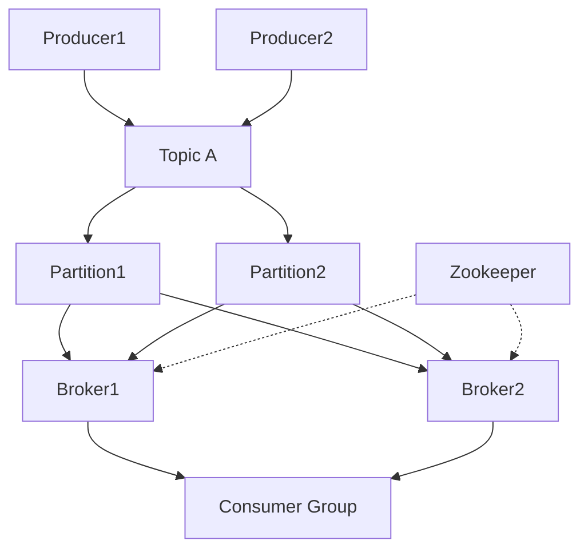

# Apache Kafka: MAANG Interview Prep Guide

## 1. Architecture & Core Concepts

### High-Level Architecture
- **Brokers:** Kafka cluster nodes that store and serve data.
- **Topics & Partitions:** Data is organized into topics, split into partitions for scalability and parallelism.
- **Producers:** Publish messages to topics.
- **Consumers & Consumer Groups:** Read messages from topics; groups enable parallelism and fault tolerance.
- **Zookeeper/KRaft:** Used for cluster coordination (KRaft is replacing Zookeeper).

**Diagram:**

### Core Concepts
- **Log:** Append-only, ordered sequence of messages per partition.
- **Offset:** Unique ID for each message in a partition.
- **Replication:** Partitions are replicated for fault tolerance.
- **Retention:** Messages are retained for a configurable period.
- **Consumer Groups:** Enable parallel consumption and load balancing.
- **Delivery Semantics:** At-most-once, at-least-once, exactly-once.

### Lifecycle
- **Message Flow:** Producer → Broker (partition) → Consumer
- **Topic Creation:** Via CLI or API; configure partitions, replication.
- **Scaling:** Add brokers/partitions; rebalance consumers.
- **Failover:** Leader election for partitions; consumers resume from last committed offset.

## 2. Interview Questions & Answers
- **Q:** How does Kafka ensure durability and fault tolerance?
  - *A:* Data is replicated across brokers. A message is acknowledged only after being written to all in-sync replicas (ISR). If a broker fails, another ISR takes over as leader.
- **Q:** What is the difference between at-least-once and exactly-once delivery?
  - *A:* At-least-once may deliver duplicates if consumers reprocess after failure. Exactly-once ensures each message is processed only once, using idempotent producers and transactional APIs.
- **Q:** How does consumer group rebalancing work?
  - *A:* When consumers join/leave, Kafka redistributes partitions among group members. This ensures load balancing and fault tolerance.
- **Q:** How do you handle backpressure in Kafka?
  - *A:* Use consumer lag monitoring, tune producer/consumer rates, and apply flow control (pause/resume consumers).
- **Q:** What happens if a consumer is slower than the producer?
  - *A:* Lag increases; if retention is exceeded, messages may be lost before consumption. Monitor lag and scale consumers as needed.

## 3. Important Kafka Commands
- **Create topic:** `kafka-topics.sh --create --topic mytopic --partitions 3 --replication-factor 2 --bootstrap-server localhost:9092`
- **List topics:** `kafka-topics.sh --list --bootstrap-server localhost:9092`
- **Describe topic:** `kafka-topics.sh --describe --topic mytopic --bootstrap-server localhost:9092`
- **Produce messages:** `kafka-console-producer.sh --topic mytopic --bootstrap-server localhost:9092`
- **Consume messages:** `kafka-console-consumer.sh --topic mytopic --from-beginning --bootstrap-server localhost:9092`
- **Monitor consumer lag:** `kafka-consumer-groups.sh --describe --group mygroup --bootstrap-server localhost:9092`

## 4. Key Metrics for Fault Tolerance
- **Consumer Lag:** Indicates if consumers are keeping up. High lag = risk of data loss.
- **In-Sync Replicas (ISR):** Partitions with all replicas in sync. Under-replicated partitions = risk.
- **Throughput:** Messages/sec. Monitor for bottlenecks.
- **Latency:** Time from produce to consume. High latency = slow consumers or overloaded brokers.
- **Under-Replicated Partitions:** Should be zero; otherwise, risk of data loss.

**Why Needed:**
- Detect slow consumers, broker failures, and data loss risk early.

**Tools:**
- **Prometheus + Grafana:** For custom metrics and dashboards.
- **Confluent Control Center:** For enterprise monitoring.
- **Burrow:** For consumer lag monitoring. 